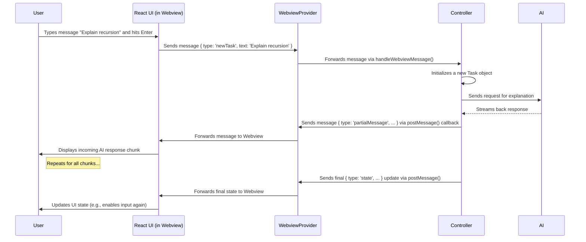

# Chapter 1: WebviewProvider

Welcome to the Cline project! If you're new here, this series of tutorials will guide you through the core concepts of the extension.

Have you ever wondered how Cline shows its chat interface, settings panels, and other custom UI elements right inside VS Code? VS Code itself is mostly built with standard editor components, but extensions like Cline can create special areas that display web content (like HTML pages with fancy JavaScript and CSS). This special area is called a **Webview**.

Our first core concept, the `WebviewProvider`, is like the **stage manager** for Cline's user interface (UI). Its main job is to set up and manage this Webview "stage" where our React-based UI performs.

**Use Case:** Imagine you open VS Code, and you see the Cline icon in the sidebar. When you click it, the Cline chat interface appears. How does that happen? That's the `WebviewProvider` in action! It creates the panel in the sidebar and loads the chat UI into it.

## What's a Webview Anyway?

Think of a Webview as a tiny, built-in web browser window directly inside VS Code. Extensions can use Webviews to:

1.  **Show Custom UIs:** Build interfaces using familiar web technologies like HTML, CSS, and JavaScript (Cline uses React). This allows for much richer and more flexible UIs than standard VS Code components alone.
2.  **Display Web Content:** Show web pages, documentation, or interactive elements.

Cline uses a Webview to display its main chat interface, settings screens, and other custom panels.

## Meet the Stage Manager: `WebviewProvider`

The `WebviewProvider` (`core/webview/index.ts`) is the class responsible for everything related to the Webview where Cline's UI lives. Like a stage manager in a theatre, it doesn't act in the play itself (that's the React UI), nor does it direct the overall plot (that's the [Controller](02_controller_.md)). Instead, it makes sure the stage is ready, secure, and that messages get passed between the actors (UI) and the director (Controller).

Here are its main jobs:

1.  **Setting up the Stage:** It creates the Webview panel when VS Code asks for it (e.g., when you click the Cline sidebar icon or open a Cline tab).
2.  **Loading the Scenery:** It loads the correct HTML file into the Webview. This HTML file includes the necessary `<script>` and `<link>` tags to load our React application's code (JavaScript) and styles (CSS).
3.  **Ensuring Security:** It sets up rules (called Content Security Policy or CSP) to make sure only trusted scripts and styles can run inside the Webview. This is crucial for security.
4.  **Relaying Messages:** It acts as a messenger between the JavaScript running inside the Webview (our React UI) and the main extension code running in Node.js (specifically, the [Controller](02_controller_.md)).

## Key Responsibilities in Action

Let's break down how `WebviewProvider` performs its duties.

**1. Creating the Stage (`resolveWebviewView`)**

When VS Code needs to show the Cline UI (e.g., in the sidebar), it calls the `resolveWebviewView` method on our `WebviewProvider`.

```typescript
// Inside core/webview/index.ts (Simplified)
export class WebviewProvider implements vscode.WebviewViewProvider {
  // ... other properties ...

  async resolveWebviewView(webviewView: vscode.WebviewView | vscode.WebviewPanel) {
    this.view = webviewView; // Keep a reference to the view

    // Configure the webview
    webviewView.webview.options = {
      enableScripts: true, // Allow JavaScript to run
      localResourceRoots: [this.context.extensionUri], // Allow loading files from our extension folder
    };

    // Set the HTML content
    webviewView.webview.html = this.getHtmlContent(webviewView.webview);

    // Set up the message listener
    this.setWebviewMessageListener(webviewView.webview);

    // ... other setup like listening for visibility changes ...
  }
  // ... other methods ...
}
```

This code snippet shows `resolveWebviewView` configuring the Webview to allow scripts and access local files, then loading the HTML and setting up message handling.

**2. Loading the Play (`getHtmlContent`)**

The `getHtmlContent` method generates the basic HTML structure for the Webview. Crucially, it includes links to the compiled JavaScript and CSS files produced by our React build process. It also includes security settings.

```typescript
// Inside core/webview/index.ts (Simplified)
private getHtmlContent(webview: vscode.Webview): string {
  // Get special URIs for loading files inside the webview
  const stylesUri = getUri(webview, this.context.extensionUri, ["webview-ui", "build", "assets", "index.css"]);
  const scriptUri = getUri(webview, this.context.extensionUri, ["webview-ui", "build", "assets", "index.js"]);
  const nonce = getNonce(); // Generate a unique security token

  return /*html*/ `
    <!DOCTYPE html>
    <html>
      <head>
        <meta http-equiv="Content-Security-Policy" content="... script-src 'nonce-${nonce}'; ...">
        <link rel="stylesheet" type="text/css" href="${stylesUri}">
        <title>Cline</title>
      </head>
      <body>
        <div id="root"></div> {/* React mounts here */}
        <script type="module" nonce="${nonce}" src="${scriptUri}"></script>
      </body>
    </html>
  `;
}
```

*   `getUri`: A helper function (`core/webview/getUri.ts`) to create special URIs that work inside a Webview.
*   `getNonce`: A helper function (`core/webview/getNonce.ts`) that generates a random, one-time-use string (a "nonce").
*   **CSP Meta Tag:** The `<meta http-equiv="Content-Security-Policy" ...>` tag tells the Webview exactly what kinds of resources are allowed to load and run. The `script-src 'nonce-${nonce}'` part means only `<script>` tags with the matching `nonce` attribute are allowed to execute. This prevents malicious scripts from running.
*   The `<link>` tag loads our UI's styles, and the `<script>` tag loads our React application's code.

**3. Relaying Messages (Two-Way Communication)**

This is perhaps the most critical role. The UI (React, running in the Webview's isolated world) needs to talk to the extension's backend (the [Controller](02_controller_.md), running in Node.js), and vice-versa. `WebviewProvider` handles this message passing.

*   **Webview (UI) to Extension (Controller):**
    When you type a message in the chat and hit Enter, the React code sends a message like `{ type: 'newTask', text: 'Your message' }`. The `WebviewProvider` listens for these messages.

    ```typescript
    // Inside core/webview/index.ts (Simplified)
    private setWebviewMessageListener(webview: vscode.Webview) {
      webview.onDidReceiveMessage(
        (message: WebviewMessage) => { // Message received from React UI
          // Pass the message to the Controller to handle the logic
          this.controller.handleWebviewMessage(message);
        },
        null,
        this.disposables,
      );
    }
    ```
    The `onDidReceiveMessage` listener catches messages from the UI and forwards them to the `controller.handleWebviewMessage` method (defined in `core/controller/index.ts`). We'll explore the [Controller](02_controller_.md) in the next chapter.

*   **Extension (Controller) to Webview (UI):**
    When the [Controller](02_controller_.md) needs to update the UI (e.g., show a response from the AI, update the task history), it needs to send a message *to* the Webview. The `WebviewProvider` exposes a way for the [Controller](02_controller_.md) to do this. When the `WebviewProvider` creates the `Controller`, it gives the `Controller` a function to call for sending messages.

    ```typescript
    // Inside core/webview/index.ts (Simplified)
    export class WebviewProvider implements vscode.WebviewViewProvider {
      controller: Controller;

      constructor(
        readonly context: vscode.ExtensionContext,
        private readonly outputChannel: vscode.OutputChannel,
      ) {
        // Give the Controller a way to post messages back to the webview
        this.controller = new Controller(
          context,
          outputChannel,
          (message) => this.view?.webview.postMessage(message) // This function sends the message
        );
      }
      // ... other methods ...
    }
    ```
    The `(message) => this.view?.webview.postMessage(message)` part is the function passed to the `Controller`. When the `Controller` calls this function, the `WebviewProvider` uses `this.view.webview.postMessage(message)` to send the data ([`ExtensionMessage`](../shared/ExtensionMessage.ts)) to the React UI running inside the Webview.

## How it Works: A Simple Flow

Let's visualize the message flow when you send a new chat message:



This diagram shows `WebviewProvider` acting as the essential intermediary, passing messages back and forth between the UI and the core logic handled by the [Controller](02_controller_.md).

## Conclusion

The `WebviewProvider` is the foundation for Cline's user interface within VS Code. It acts as the "stage manager," responsible for:

*   Creating and setting up the Webview panel (the stage).
*   Loading the React application (the actors and scenery) via HTML.
*   Enforcing security rules (CSP).
*   Facilitating the crucial two-way communication between the React UI and the extension's backend logic.

Understanding the `WebviewProvider` helps you see how Cline integrates a modern web UI directly into the VS Code environment.

Now that we've seen how the UI is presented and communicates, let's move on to the brain behind the operation: the class that handles the application logic and orchestrates tasks.

**Next Up:** [Chapter 2: Controller](02_controller_.md)

---

Generated by [AI Codebase Knowledge Builder](https://github.com/The-Pocket/Tutorial-Codebase-Knowledge)