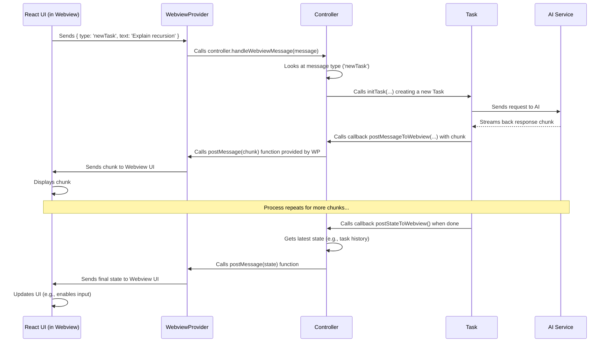

# Chapter 2: Controller

In the [previous chapter](01_webviewprovider_.md), we learned about the `WebviewProvider`, which acts like the "stage manager" setting up the user interface (UI) inside VS Code. But who directs the actual show? When you type a message in the chat, click a button in the settings, or interact with Cline in any way, how does the extension know what to *do* with that information?

That's where the **`Controller`** comes in! It's the central coordinator, the "brain," or perhaps the **"air traffic controller"** of Cline's backend.

**Use Case:** Imagine you type "Explain recursion" into the Cline chat box and hit Enter. The UI needs to send this message somewhere, that 'somewhere' needs to figure out you want to start a new chat with an AI, manage the conversation, get the AI's response, and then tell the UI to display that response. The `Controller` is the central piece making all this happen smoothly.

## What Does the Controller Do?

The `Controller` (`core/controller/index.ts`) acts as the main hub connecting the user interface ([WebviewProvider](01_webviewprovider_.md)) with the core application logic (which we'll see soon in the [Task](03_task_.md) chapter).

Think of it like an air traffic controller at an airport:

1.  **Receives Incoming Traffic (Messages from UI):** Just like an air traffic controller receives requests from pilots (planes wanting to land or take off), the `Controller` receives messages from the JavaScript running in the Webview (our React UI). These messages represent user actions like typing a message, changing a setting, or clicking a button.
2.  **Manages the Airport (Application State):** The controller keeps track of important information – the "state" of the application. This includes things like your API keys, chosen settings (like which AI model to use), and the history of your past conversations. It ensures this information is consistent and up-to-date.
3.  **Directs Planes (Initializes Tasks):** When you send a new chat message, the `Controller` doesn't usually handle the entire conversation itself. Instead, it acts like the controller assigning a runway and flight plan to a plane. It initializes a new `Task` object, giving it the necessary information (your message, API keys, settings) to handle the specific job (like talking to the AI).
4.  **Sends Outgoing Traffic (Updates to UI):** As the AI responds or the state changes (e.g., a setting is updated), the `Controller` receives this new information (often from the `Task`) and sends messages back to the `WebviewProvider` to update the UI, displaying the AI's response or reflecting the new settings.

## How it Works: Handling a Chat Message

Let's follow our "Explain recursion" example step-by-step to see the `Controller` in action:

1.  **User Input:** You type "Explain recursion" and hit Enter in the Cline chat UI (React).
2.  **UI Sends Message:** The React code running in the Webview sends a message like `{ type: 'newTask', text: 'Explain recursion' }` to the extension backend.
3.  **WebviewProvider Relays:** As we saw in [Chapter 1](01_webviewprovider_.md), the `WebviewProvider` catches this message using `onDidReceiveMessage`.
4.  **Controller Receives:** The `WebviewProvider` immediately forwards the message to the `Controller` by calling its `handleWebviewMessage` method.

    ```typescript
    // Inside core/webview/index.ts (Simplified from Chapter 1)
    private setWebviewMessageListener(webview: vscode.Webview) {
      webview.onDidReceiveMessage(
        (message: WebviewMessage) => { // Message received from React UI
          // ---> Pass the message to the Controller! <---
          this.controller.handleWebviewMessage(message);
        },
        // ... other parameters ...
      );
    }
    ```

5.  **Controller Decides:** The `Controller`'s `handleWebviewMessage` method looks at the `type` of the message (`'newTask'`) and decides what to do.

    ```typescript
    // Inside core/controller/index.ts (Simplified)
    export class Controller {
      // ... other properties like 'task', 'context' ...
      private postMessage: (message: ExtensionMessage) => Thenable<boolean> | undefined;

      // ... constructor ...

      async handleWebviewMessage(message: WebviewMessage) {
        switch (message.type) {
          // ---> It's a 'newTask' message! <---
          case "newTask":
            // Let's start a new Task to handle this request
            await this.initTask(message.text, message.images);
            break;
          // ... other cases for settings changes, button clicks, etc. ...
          case "apiConfiguration":
            // Update stored settings based on message.apiConfiguration
            // await updateApiConfiguration(...);
            // Send the updated state back to the UI
            await this.postStateToWebview();
            break;
          // ... many more cases ...
        }
      }
      // ... other methods like initTask, postStateToWebview ...
    }
    ```
    This `switch` statement is the heart of the message routing. It directs different user actions to the correct logic within the `Controller`.

6.  **Controller Initializes Task:** For a `'newTask'` message, the `Controller` calls its `initTask` method. This method gathers the current settings and API keys, creates a new [Task](03_task_.md) object, and gives it the user's message ("Explain recursion").

    ```typescript
    // Inside core/controller/index.ts (Simplified)
    async initTask(task?: string, images?: string[], historyItem?: HistoryItem) {
      // First, clean up any old task
      await this.clearTask();

      // Get current settings needed for the task
      const { apiConfiguration, customInstructions, /* ... */ } =
        await getAllExtensionState(this.context); // Fetches saved state

      // ---> Create the new Task object <---
      this.task = new Task(
        this.context,
        // ... lots of parameters passed to the Task ...
        apiConfiguration, // Give it the API settings
        customInstructions, // Give it custom instructions
        task, // The user's message: "Explain recursion"
        images,
        historyItem,
        // Functions for the Task to call back to the Controller:
        (historyItem) => this.updateTaskHistory(historyItem),
        () => this.postStateToWebview(),
        (message) => this.postMessageToWebview(message),
        // ... and more callback functions ...
      );
      // Now the Task object will start processing the request...
    }
    ```
    Notice how the `Controller` gives the `Task` several functions (like `postStateToWebview`, `postMessageToWebview`). This is how the `Task` can send information *back* to the `Controller` later.

7.  **Task Does the Work:** The newly created [Task](03_task_.md) object now takes over. It formats the request, communicates with the AI using the [ApiHandler](04_apihandler_.md), and processes the response. (We'll dive into the [Task](03_task_.md) in the next chapter!).
8.  **Task Sends Updates Back:** As the AI sends back chunks of the explanation, the `Task` uses the callback functions it received from the `Controller`. For example, it might call `postMessageToWebview({ type: 'partialMessage', text: 'Recursion is when...' })`.
9.  **Controller Relays to UI:** The `Controller`'s `postMessageToWebview` method simply uses the `postMessage` function it got from the `WebviewProvider` during setup.

    ```typescript
    // Inside core/controller/index.ts (Simplified)
    async postMessageToWebview(message: ExtensionMessage) {
      // ---> Use the function given by WebviewProvider <---
      await this.postMessage(message);
    }

    // Remember how the Controller got this 'postMessage' function?
    // Inside core/webview/index.ts (Simplified Constructor)
    export class WebviewProvider /* ... */ {
      controller: Controller;
      constructor(/* ... */) {
        this.controller = new Controller(
          context,
          outputChannel,
          // ---> HERE: Give the Controller a function to send messages <---
          (message) => this.view?.webview.postMessage(message)
        );
      }
      // ...
    }
    ```
    This `postMessage` function sends the message (e.g., the AI's partial response) back to the `WebviewProvider`.

10. **WebviewProvider Updates UI:** The `WebviewProvider` sends the message into the Webview, where the React UI receives it and displays the text "Recursion is when..." to you.

This loop (UI -> WebviewProvider -> Controller -> Task -> Controller -> WebviewProvider -> UI) continues until the AI finishes responding.

## Visualizing the Flow

Here's a simplified diagram showing the `Controller`'s central role when you send a message:



This diagram highlights how the `Controller` receives the initial request, delegates the heavy lifting to the `Task`, and then relays updates back to the UI via the `WebviewProvider`.

## Other Key Responsibilities

Besides handling new tasks, the `Controller` also manages:

*   **Settings:** When you change a setting in the UI, a message like `{ type: 'apiConfiguration', ... }` is sent. The `Controller` receives this in `handleWebviewMessage`, updates the stored settings using functions from `core/storage/state.ts`, and then calls `postStateToWebview` to send the complete, updated state back to the UI so it reflects the change.
*   **State Synchronization:** The `postStateToWebview` method is crucial. It gathers *all* the relevant application state (API keys, settings, task history, current task messages, etc.) into one big `ExtensionState` object and sends it to the UI. This ensures the UI always has the latest picture of what's going on in the backend. This happens after settings changes, when a task finishes, or when the webview first launches (`webviewDidLaunch` message).
*   **Task Lifecycle:** Methods like `clearTask` and `cancelTask` are used to manage the active [Task](03_task_.md). For example, before starting a new task, `initTask` calls `clearTask` to ensure any previous task is properly stopped and cleaned up.
*   **gRPC Communication:** For more complex interactions that might involve multiple back-and-forth messages (like file operations or managing browser sessions), Cline uses a system called gRPC. The `Controller` has a `GrpcHandler` (`core/controller/grpc-handler.ts`) that receives these gRPC requests from the webview (via a special message type `grpc_request`) and routes them to the appropriate service logic (e.g., `handleFileServiceRequest`, `handleBrowserServiceRequest`). We'll touch on gRPC in more detail in [Chapter 9](09_grpchandler___serviceregistry_.md).

## Conclusion

The `Controller` is the indispensable central nervous system of the Cline extension backend. It doesn't do everything itself, but it knows *who* should do what and ensures smooth communication between all the parts.

*   It listens for user actions coming from the **[WebviewProvider](01_webviewprovider_.md)**.
*   It manages the application's **state** (settings, history).
*   It **delegates** specific jobs (like handling an AI conversation) by creating and managing **[Task](03_task_.md)** objects.
*   It sends **updates** and state changes back to the **[WebviewProvider](01_webviewprovider_.md)** to keep the UI synchronized.

By acting as this central coordinator, the `Controller` keeps the codebase organized and ensures that messages and state flow correctly throughout the extension.

Now that we understand how the `Controller` receives requests and orchestrates the work, let's dive into the component that handles the core logic for a single user request: the `Task`.

**Next Up:** [Chapter 3: Task](03_task_.md)

---

Generated by [AI Codebase Knowledge Builder](https://github.com/The-Pocket/Tutorial-Codebase-Knowledge)