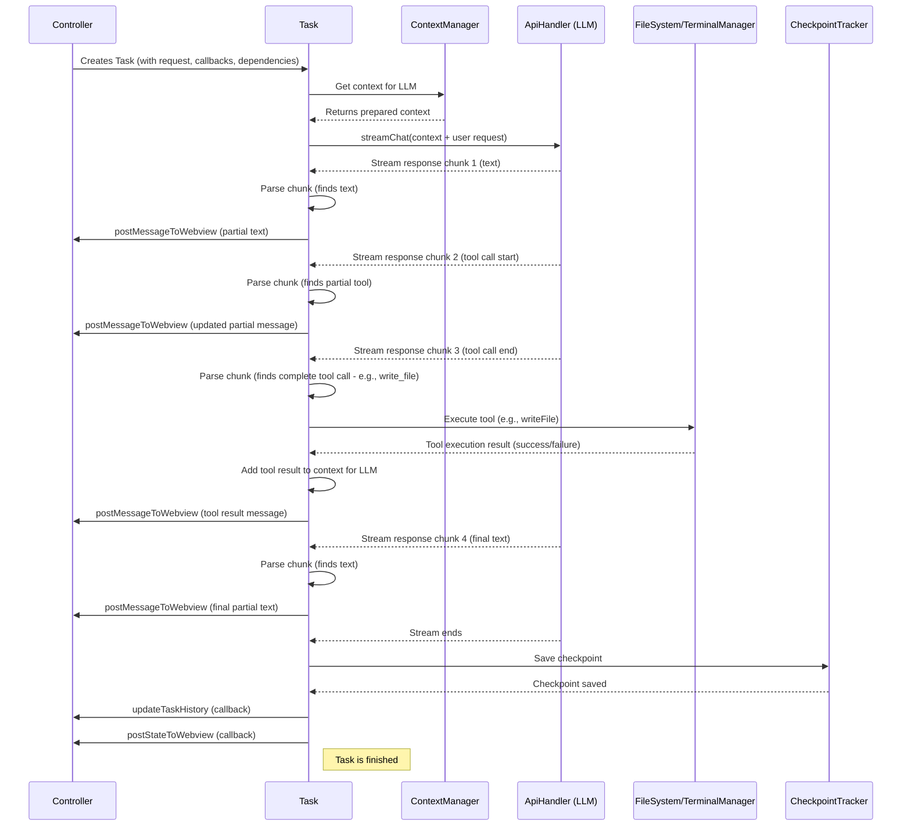

# Chapter 3: Task

In the [previous chapter](02_controller_.md), we met the `Controller`, the central coordinator that receives user requests and decides what to do. We saw that when you send a new chat message like "Explain recursion," the `Controller` doesn't handle the entire AI conversation itself. Instead, it delegates the job. But who does it delegate to?

Meet the **`Task`**! If the `Controller` is the air traffic controller assigning a flight plan, the `Task` is like the **dedicated project manager** assigned to that specific flight (your request). Its sole job is to take one user request and see it through from start to finish, managing all the resources and steps needed to get the job done.

**Use Case:** You've just typed "Explain recursion and write a simple example in Python" into Cline. The [Controller](02_controller_.md) receives this and says, "Okay, new request! I need someone to handle this." It then creates a new `Task` object specifically for this request. This `Task` object will now manage everything: figuring out the context, talking to the AI, getting the explanation and code, maybe even saving the code to a file if you ask, and reporting progress back to the UI.

## What Does a Task Do?

Think of a `Task` (`core/task/index.ts`) as a focused worker responsible for fulfilling *one* specific user request or conversation thread. It doesn't manage the whole application like the [Controller](02_controller_.md); it just manages its assigned job.

Here's a breakdown of its responsibilities:

1.  **Receives the Mission:** Gets the user's request (e.g., "Explain recursion..."), settings, and necessary tools (like API keys) from the [Controller](02_controller_.md).
2.  **Gathers Background Info (Context):** Works with the [ContextManager](06_contextmanager_.md) to prepare the conversation history and other relevant information (like files you've mentioned) to send to the AI.
3.  **Contacts the Expert (LLM):** Uses the [ApiHandler](04_apihandler_.md) to send the request and context to the chosen Large Language Model (LLM).
4.  **Listens for Updates (Streaming):** Receives the AI's response, often piece by piece (streaming).
5.  **Deciphers the Response (Parsing):** Analyzes the incoming AI message. Does it contain text? Code? Does the AI want to use a tool (like `read_file` or `execute_command`)? It uses `parseAssistantMessage` (`core/assistant-message/parse-assistant-message.ts`) to understand the structure.
6.  **Gets Hands-On (Tool Execution):** If the AI requests a tool, the `Task` coordinates its execution. This might involve reading/writing files or running commands via the [TerminalManager](07_terminalmanager_.md).
7.  **Saves Progress (Checkpoints):** Works with the [CheckpointTracker](05_checkpointtracker_.md) to save snapshots of the conversation state, allowing you to go back in time.
8.  **Reports Back (UI Updates):** Sends messages back to the [Controller](02_controller_.md) (which then relays them to the UI) to show the AI's response, indicate progress, or update the overall state.

Essentially, the `Task` is the engine that drives a single conversation turn or user request to completion.

## How it Works: Handling "Explain recursion..."

Let's follow our example: "Explain recursion and write a simple example in Python."

1.  **Initialization:** The [Controller](02_controller_.md), having received the message, creates a new `Task` instance. It passes along the user's text, API configuration, callback functions for updating the UI, and other necessary components like the [McpHub](08_mcphub__model_context_protocol_hub_.md) and [WorkspaceTracker](integrations/workspace/WorkspaceTracker.ts).

    ```typescript
    // Inside core/controller/index.ts (Simplified 'initTask' from Chapter 2)
    async initTask(task?: string, images?: string[]) {
      // ... gather settings ...

      // ---> Create the new Task object <---
      this.task = new Task(
        this.context,
        this.mcpHub,         // Tool coordinator
        this.workspaceTracker, // Workspace info
        // --- Callbacks for Task to talk back to Controller ---
        (historyItem) => this.updateTaskHistory(historyItem), // Update history list
        () => this.postStateToWebview(),                  // Send full state update
        (message) => this.postMessageToWebview(message),    // Send partial message update
        // --- Other dependencies & settings ---
        apiConfiguration,   // API keys, model choice
        // ... other parameters ...
        task,               // The user's message: "Explain recursion..."
        images,             // Any images provided
      );
      // Task constructor immediately starts the work (e.g., calls runTask())
    }
    ```
    The `Task` is given everything it needs, including ways to communicate back (`postMessageToWebview`, `postStateToWebview`).

2.  **Running the Task:** The `Task` constructor typically kicks off its main logic, often in a method like `runTask`.

    ```typescript
    // Inside core/task/index.ts (Simplified Task class)
    export class Task {
      // ... properties like api, contextManager, terminalManager ...
      private postMessageToWebview: (message: ExtensionMessage) => Promise<void>;
      private postStateToWebview: () => Promise<void>;
      // ... other properties ...

      constructor(/* ... dependencies and callbacks ... */) {
        // Store dependencies and callbacks
        this.postMessageToWebview = postMessageCallback;
        this.postStateToWebview = postStateCallback;
        // ... initialize other managers like ContextManager, ApiHandler ...
        this.api = buildApiHandler(apiConfiguration);
        this.contextManager = new ContextManager(/*...*/);
        this.terminalManager = new TerminalManager(/*...*/);
        this.checkpointTracker = new CheckpointTracker(/*...*/);

        // Start processing the request
        this.runTask().catch(error => {
          console.error("Task failed:", error);
          // Report error to UI via callback
          this.postMessageToWebview({ type: "error", text: "Task failed..." });
        });
      }

      async runTask() {
        // 1. Prepare context (using this.contextManager)
        const { truncatedConversationHistory } = await this.contextManager.getNewContextMessagesAndMetadata(/*...*/);

        // 2. Add user's new message to history
        const apiMessages = [...truncatedConversationHistory, { role: 'user', content: this.userMessage }];

        // 3. Call the LLM API (using this.api)
        const stream = this.api.streamChat(apiMessages, /* ... other options ... */);

        // 4. Process the streaming response
        let fullAssistantMessage = "";
        for await (const chunk of stream) {
          fullAssistantMessage += chunk;
          // Parse the partial message
          const parsedContent = parseAssistantMessage(fullAssistantMessage);

          // Send partial update to UI
          this.postMessageToWebview({
            type: 'partialMessage',
            partialMessage: { /* ... construct ClineMessage ... */ }
          });

          // 5. Check for and handle tool calls within the loop (simplified)
          const lastBlock = parsedContent[parsedContent.length - 1];
          if (lastBlock?.type === 'tool_use' && !lastBlock.partial) {
             await this.handleToolCall(lastBlock);
             // Tool results are added to apiMessages for the *next* LLM call
          }
        }

        // 6. Finalize: Update history, save checkpoint, update UI state
        await this.saveCheckpoint();
        await this.updateHistory(); // Uses callback to Controller
        await this.postStateToWebview(); // Uses callback to Controller
      }
      // ... other methods like handleToolCall, saveCheckpoint, updateHistory ...
    }
    ```
    This simplified `runTask` shows the core flow: prepare context, call the API, process the stream, handle tools, and finalize.

3.  **Context Preparation:** The `Task` uses its `ContextManager` instance to get the relevant conversation history, potentially truncating it if it's too long for the LLM's context window.

4.  **LLM Interaction:** The `Task` calls `this.api.streamChat(...)` using its [ApiHandler](04_apihandler_.md) instance, sending the prepared messages.

5.  **Streaming & Parsing:** As chunks of the response arrive (`for await (const chunk of stream)`), the `Task` appends them to build the full message. Crucially, it calls `parseAssistantMessage` on the *current* full message string. This function breaks the string down into text blocks and tool use blocks (even if they are incomplete or "partial").

    ```typescript
    // Inside core/assistant-message/parse-assistant-message.ts (Conceptual)
    function parseAssistantMessage(message: string): AssistantMessageContent[] {
      // Logic to find <tool_name>...</tool_name> tags
      // Logic to find <param_name>...</param_name> tags within tools
      // Logic to identify plain text segments between/around tags
      // Returns an array like:
      // [
      //   { type: 'text', content: 'Recursion is a concept where...' },
      //   { type: 'tool_use', name: 'write_to_file', params: { path: '...', content: '...' }, partial: false },
      //   { type: 'text', content: 'Let me know if you need more examples.', partial: true } // maybe stream ended mid-text
      // ]
      // ... implementation omitted for brevity ...
      return []; // Placeholder
    }
    ```
    This parsing allows the `Task` to understand the AI's intent, even mid-stream.

6.  **UI Update (Partial):** The `Task` uses the `postMessageToWebview` callback to send the partially parsed content to the UI, so you see the response appear incrementally.

7.  **Tool Handling (If Any):** If `parseAssistantMessage` identifies a *complete* tool use block (like `<write_to_file>...</write_to_file>`), the `Task` pauses processing the main response and calls a method like `handleToolCall`.

    ```typescript
    // Inside core/task/index.ts (Simplified Task class)
    async handleToolCall(toolUse: ToolUse) {
      let result: string;
      try {
        switch (toolUse.name) {
          case "execute_command":
            // Use TerminalManager to run the command
            result = await this.terminalManager.executeCommand(toolUse.params.command);
            break;
          case "read_file":
            // Use Node.js 'fs' module (or helper) to read the file
            result = await fs.readFile(path.join(cwd, toolUse.params.path), 'utf8');
            break;
          case "write_to_file":
            // Use Node.js 'fs' module (or helper) to write the file
            await fs.writeFile(path.join(cwd, toolUse.params.path), toolUse.params.content);
            result = `Successfully wrote to ${toolUse.params.path}`;
            break;
          // ... other tools ...
          default:
            result = `Error: Unknown tool ${toolUse.name}`;
        }
        // Send tool result back to UI for display
        this.postMessageToWebview({ type: 'say', say: { tool: 'tool', content: result }});
      } catch (error) {
        result = `Error executing tool ${toolUse.name}: ${error}`;
        // Send error back to UI
        this.postMessageToWebview({ type: 'error', text: result });
      }

      // IMPORTANT: Add the tool result back into the conversation history
      // so the LLM knows what happened when we call it again.
      // (Logic to add tool result message to apiMessages omitted)
    }
    ```
    This handler uses other components like `TerminalManager` or filesystem functions to execute the tool, gets the result, reports it to the UI, and (crucially, though omitted above) prepares the result to be included in the *next* message sent to the LLM.

8.  **Checkpoints & Finalization:** Once the AI finishes streaming (and any final tool calls are handled), the `Task` uses the `CheckpointTracker` to save the state, updates the permanent task history via a controller callback, and sends a final state update to the UI using `postStateToWebview`.

## Visualizing the Task's Role

This diagram shows how a `Task` interacts with other core components to handle a user request that involves an LLM call and a tool execution:



This shows the `Task` as the central coordinator for *its specific job*, orchestrating interactions between the context preparation (`ContextManager`), the AI (`ApiHandler`), the system tools (`FileSystem`/`TerminalManager`), state saving (`CheckpointTracker`), and reporting back to the main `Controller`.

## Conclusion

The `Task` object is the workhorse of Cline. It takes a single user request and manages its entire lifecycle:

*   It's created and configured by the **[Controller](02_controller_.md)**.
*   It prepares the necessary context using the **[ContextManager](06_contextmanager_.md)**.
*   It interacts with the LLM via the **[ApiHandler](04_apihandler_.md)**.
*   It handles streaming responses and parses them for text and tool calls.
*   It executes tools using resources like the **[TerminalManager](07_terminalmanager_.md)**.
*   It saves progress using the **[CheckpointTracker](05_checkpointtracker_.md)**.
*   It communicates progress and final results back to the **[Controller](02_controller_.md)** to update the UI.

By encapsulating the logic for a single request, the `Task` keeps the `Controller` clean and allows Cline to potentially handle multiple concurrent operations in the future (though currently, it focuses on one task at a time).

Now that we understand how a `Task` manages a request, let's zoom in on how it actually communicates with the AI.

**Next Up:** [Chapter 4: ApiHandler](04_apihandler_.md)

---

Generated by [AI Codebase Knowledge Builder](https://github.com/The-Pocket/Tutorial-Codebase-Knowledge)