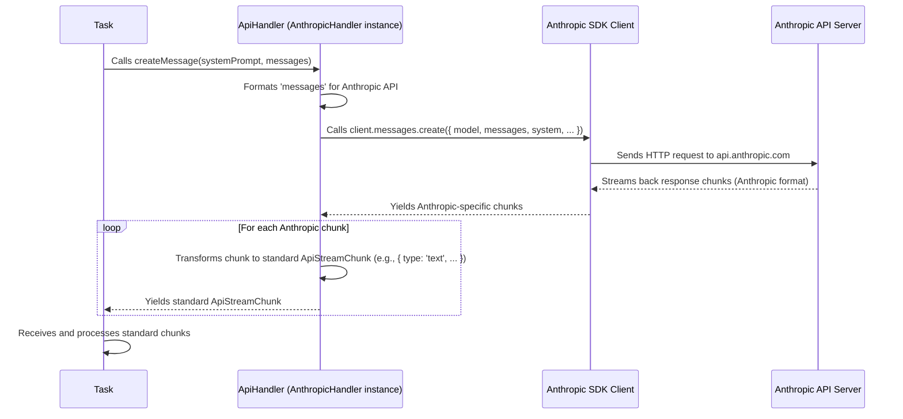

# Chapter 4: ApiHandler

In the [previous chapter](03_task_.md), we saw how the `Task` object acts like a project manager, taking your request (like "Explain recursion") and managing the steps to get an answer. One crucial step is actually *talking* to the Artificial Intelligence (AI) – the Large Language Model (LLM).

But there's a challenge: Cline supports many different AI providers, like Anthropic (Claude models), OpenAI (GPT models), Google (Gemini models), and others running locally (like Ollama). Each of these providers has its own unique way of being called – its own specific API (Application Programming Interface). It's like trying to plug a European appliance into an American wall socket – they just don't fit directly!

How can our `Task` object talk to *any* of these AIs without needing to write completely separate code for each one?

That's where the **`ApiHandler`** comes in. Think of it as a **universal travel adapter** for AI models.

**Use Case:** Imagine you've selected the "Claude 3 Haiku" model in Cline's settings. You type "Explain recursion" and hit Enter. The [Task](03_task_.md) needs to send this message specifically to Anthropic's servers using Anthropic's rules. If you later switch to "GPT-4o" in the settings and ask another question, the [Task](03_task_.md) needs to send *that* message to OpenAI's servers using *OpenAI's* rules. The `ApiHandler` makes it possible for the `Task` to do this using the *same* core code, just plugging in a different "adapter."

## The Universal Remote Control: `ApiHandler` Interface

The `ApiHandler` isn't one single piece of code; it's more like a blueprint or a contract. It defines a standard set of "buttons" that *any* AI provider adapter must have. In Cline, this blueprint is defined in an `interface` (a common concept in TypeScript).

```typescript
// Inside api/index.ts (Simplified)
export interface ApiHandler {
  // The standard "button" to start a chat stream
  createMessage(
    systemPrompt: string,
    messages: MessageParam[] // Standard message format
  ): ApiStream; // Standard way to get the response back

  // Another standard "button" to get info about the selected model
  getModel(): { id: string; info: ModelInfo };

  // ... maybe other standard buttons ...
}

// Represents a standard stream of response parts
type ApiStream = AsyncGenerator<ApiStreamChunk>;
```

This interface says: "Any class that claims to be an `ApiHandler` *must* provide a `createMessage` function that takes a system prompt and messages (in a standard format) and returns a response stream (in a standard format). It must also provide a `getModel` function."

This is like defining the buttons on a universal remote: "Must have a 'channel up' button," "Must have a 'volume down' button."

## Different Remotes for Different TVs: Provider-Specific Handlers

Now, for each AI provider Cline supports, we have a specific class that *implements* this `ApiHandler` interface. These are like the actual electronic circuits inside the universal remote that know how to send the correct infrared signal for a specific TV brand when you press a button.

*   **`AnthropicHandler` (`api/providers/anthropic.ts`):** Knows how to talk to Anthropic's API (for Claude models).
*   **`OpenAiHandler` (`api/providers/openai.ts`):** Knows how to talk to OpenAI's API (for GPT models, including Azure).
*   **`AwsBedrockHandler` (`api/providers/bedrock.ts`):** Knows how to talk to AWS Bedrock (which can host various models).
*   **`OllamaHandler` (`api/providers/ollama.ts`):** Knows how to talk to a local Ollama server.
*   ...and many more!

Each of these classes has its *own* `createMessage` method, but inside that method, it does the specific work needed for its provider: formatting the request correctly, using the right security keys, calling the right web address, and translating the provider's unique response format back into the standard `ApiStream` format that the rest of Cline expects.

## The Factory: `buildApiHandler`

So, if we have all these different handler classes, how does the [Task](03_task_.md) get the *right one* based on your settings? That's the job of the `buildApiHandler` function. It acts like a **factory**.

You give `buildApiHandler` the current configuration (which provider you selected, your API key, the specific model ID), and it builds and returns the correct `ApiHandler` instance.

```typescript
// Inside api/index.ts (Simplified)
import { AnthropicHandler } from "./providers/anthropic";
import { OpenAiHandler } from "./providers/openai";
// ... import other handlers ...

export function buildApiHandler(configuration: ApiConfiguration): ApiHandler {
  const { apiProvider, ...options } = configuration; // Get provider choice

  // Decide which specific handler to create
  switch (apiProvider) {
    case "anthropic":
      return new AnthropicHandler(options); // Build Anthropic adapter
    case "openai":
      return new OpenAiHandler(options); // Build OpenAI adapter
    case "bedrock":
      return new AwsBedrockHandler(options); // Build Bedrock adapter
    // ... cases for all other supported providers ...
    default:
      // If unknown, maybe default to one
      return new AnthropicHandler(options);
  }
}
```

This function looks at the `apiProvider` setting (e.g., "anthropic", "openai") and uses a `switch` statement to construct and return an instance of the corresponding handler class.

## How the Task Uses the Adapter

Now, let's see how the [Task](03_task_.md) uses this system.

1.  **Getting the Handler:** When the [Controller](02_controller_.md) creates a new [Task](03_task_.md), it first gets the current API configuration from your settings. It then calls `buildApiHandler` to create the appropriate handler instance and passes it to the `Task`.

    ```typescript
    // Inside core/task/index.ts (Simplified Task constructor)
    constructor(/* ..., apiConfiguration, ... */) {
      // ... other setup ...

      // ---> Get the right adapter from the factory <---
      this.api = buildApiHandler(apiConfiguration);

      // ... start the task ...
    }
    ```
    The `Task` now holds an `ApiHandler` instance in `this.api`, but it doesn't know or care *which specific* handler it is (Anthropic, OpenAI, etc.).

2.  **Using the Standard Interface:** Later, when the `Task` needs to send the message to the AI, it simply calls the `createMessage` method on the handler it received.

    ```typescript
    // Inside core/task/index.ts (Simplified Task runTask method)
    async runTask() {
      // ... prepare context and messages ...
      const apiMessages = [/* ... user message, history ... */];
      const systemPrompt = "You are a helpful assistant.";

      // ---> Use the standard "button" <---
      const stream: ApiStream = this.api.createMessage(systemPrompt, apiMessages);

      // Process the standard response stream
      for await (const chunk of stream) {
        // Handle standard chunk types (text, usage, reasoning)
        if (chunk.type === 'text') {
          // Send text chunk to UI
          this.postMessageToWebview({ type: 'partialMessage', ... });
        }
        // ... handle other chunk types ...
      }
      // ... finalize task ...
    }
    ```
    Notice that `runTask` calls `this.api.createMessage`. Because `this.api` could be an `AnthropicHandler`, an `OpenAiHandler`, or any other `ApiHandler`, this *same code* works regardless of which AI provider is selected! It relies on the `ApiHandler` interface contract.

## Under the Hood: How `createMessage` Works

Let's trace what happens when the `Task` calls `api.createMessage(...)`, assuming the user selected an Anthropic model.



1.  The [Task](03_task_.md) calls `createMessage` on its `ApiHandler` instance (which happens to be an `AnthropicHandler`).
2.  The `AnthropicHandler`'s `createMessage` method takes the standard `messages`.
3.  It uses the official Anthropic SDK (`this.client`) to make the actual API call, passing the messages in the format Anthropic expects.
4.  The Anthropic SDK sends the request over the internet to Anthropic's servers.
5.  Anthropic's servers stream back the response, chunk by chunk, in Anthropic's specific format.
6.  The `AnthropicHandler` receives these specific chunks.
7.  For each incoming chunk, it **transforms** the data into the standard `ApiStreamChunk` format (like `{ type: 'text', text: '...' }` or `{ type: 'usage', ... }`).
8.  It `yield`s this standard chunk back to the [Task](03_task_.md).
9.  The [Task](03_task_.md) receives these standard chunks and processes them, updating the UI.

Let's look at a highly simplified code example inside a specific handler:

```typescript
// Inside api/providers/anthropic.ts (Highly Simplified)
import { Anthropic } from "@anthropic-ai/sdk"; // Official SDK
import { ApiHandler, ApiStream } from "../index"; // Our interfaces
import { ApiHandlerOptions } from "@shared/api";

export class AnthropicHandler implements ApiHandler {
  private client: Anthropic;

  constructor(options: ApiHandlerOptions) {
    // Setup the official Anthropic client with API key etc.
    this.client = new Anthropic({ apiKey: options.apiKey, /*...*/ });
  }

  async *createMessage(systemPrompt: string, messages: MessageParam[]): ApiStream {
    // 1. Call the provider-specific SDK method
    const providerStream = await this.client.messages.create({
      model: this.getModel().id,
      system: [{ type: "text", text: systemPrompt }],
      messages: messages, // Already in Anthropic format for simplicity here
      max_tokens: 4096,
      stream: true,
    });

    // 2. Loop through the provider's response stream
    for await (const providerChunk of providerStream) {
      // 3. Transform provider chunk to standard chunk and yield
      if (providerChunk.type === "content_block_delta" && providerChunk.delta.type === "text_delta") {
        yield { type: "text", text: providerChunk.delta.text };
      } else if (providerChunk.type === "message_start") {
        // Extract usage info if available
        yield { type: "usage", inputTokens: providerChunk.message.usage.input_tokens, /*...*/ };
      }
      // ... handle other provider-specific chunk types ...
    }
  }

  getModel() { /* ... returns model info ... */ }
}
```

This shows the core pattern:
1.  Use the provider's SDK (`this.client.messages.create`).
2.  Iterate through the response (`for await`).
3.  Translate (`if/else` or `switch`) the specific `providerChunk` into the standard format and `yield` it.

Every provider handler (`OpenAiHandler`, `GeminiHandler`, etc.) follows this same pattern but uses its own specific SDK and translation logic.

## Conclusion

The `ApiHandler` abstraction is key to Cline's flexibility in supporting multiple AI providers.

*   It defines a **standard interface** (`ApiHandler`) for how the application interacts with any LLM.
*   **Specific handler classes** (`AnthropicHandler`, `OpenAiHandler`, etc.) implement this interface, each containing the unique logic for one provider.
*   The **`buildApiHandler` factory function** creates the correct handler instance based on user configuration.
*   Components like the [Task](03_task_.md) interact with the AI **only through the standard `ApiHandler` interface**, remaining unaware of the specific provider details.

This design acts like a universal adapter, allowing Cline to easily add support for new AI providers in the future without changing the core application logic significantly. You just need to create a new handler class that implements the `ApiHandler` interface and add it to the `buildApiHandler` factory.

Now that we understand how the `Task` communicates with the AI and gets responses, how does Cline allow you to "rewind" or manage different states within a single conversation?

**Next Up:** [Chapter 5: CheckpointTracker](05_checkpointtracker_.md)

---

Generated by [AI Codebase Knowledge Builder](https://github.com/The-Pocket/Tutorial-Codebase-Knowledge)