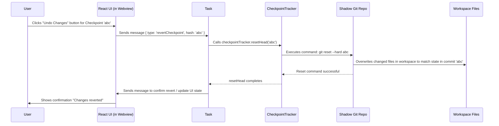

# Chapter 5: CheckpointTracker

In the [previous chapter](04_apihandler_.md), we learned how the `ApiHandler` acts as a universal adapter, allowing Cline's [Task](03_task_.md) object to talk to various AI models like Claude, GPT, or Gemini. The AI might respond with text, but sometimes it might suggest changes to your code or even automatically apply them to your files!

But what happens if the AI makes a mistake? What if the code it wrote breaks your project, or you simply don't like the changes it made to your files? How can you easily undo just the changes Cline made, without losing other work you might have done?

That's where the **`CheckpointTracker`** comes in! It's like having **automatic save points in a video game**, but for your code files.

**Use Case:** Imagine you ask Cline: "Add a function to `utils.py` that calculates the average of a list." Cline uses its tools to edit the `utils.py` file directly. You look at the new function, but maybe it has a bug, or it's not exactly what you wanted. You wish you could just instantly revert `utils.py` back to how it was *right before* Cline made the edit. The `CheckpointTracker` makes this possible!

## What is a Checkpoint?

Think of a "checkpoint" as a snapshot or a saved state of all the files in your project's workspace at a particular moment in time. The `CheckpointTracker` is responsible for creating these snapshots and allowing you to restore your files back to a previous snapshot.

It provides a safety net, ensuring that even if Cline modifies your files, you always have a way to go back.

## The Magic Trick: A Hidden "Shadow" Git

"Wait," you might be thinking, "doesn't Git already do this?" Yes, Git is a version control system used for tracking changes. Many projects already have their own `.git` repository.

However, Cline's `CheckpointTracker` needs to work *independently* of your project's main Git history. You don't want Cline's automatic saves cluttering up your carefully crafted project commits!

So, `CheckpointTracker` uses a clever trick:

1.  **Separate Storage:** It creates a *completely separate*, hidden Git repository. This isn't the `.git` folder in your project; it's usually stored deep inside VS Code's extension storage directory (e.g., `~/.vscode/extensions/.../globalStorage/checkpoints/...`). We call this the **"shadow Git" repository**.
2.  **Workspace Focus:** This shadow Git repository is specifically configured to track the files within your *current VS Code workspace*.
3.  **Isolation:** It doesn't interfere with your project's main Git repository at all. Your `git log` remains clean, showing only *your* commits. The shadow Git is purely for Cline's internal undo/redo capability.

Think of it like Cline keeping its own private diary (the shadow Git) about your workspace files, separate from your project's official history book (your main Git).

## How Checkpoints Work: The Basic Idea

The `CheckpointTracker` uses standard Git commands behind the scenes on its shadow repository:

1.  **Creating a Checkpoint (`commit`):**
    *   When Cline is about to perform an action that might change files (like letting the AI edit a file), the [Task](03_task_.md) asks `CheckpointTracker` to save the current state.
    *   `CheckpointTracker` tells its shadow Git: "Okay, record how all the files look *right now*."
    *   Technically, it runs commands similar to `git add .` (stage all file changes) and `git commit -m "checkpoint-..."` (save the staged changes as a snapshot) within the shadow repository.
    *   Each commit in the shadow Git represents a checkpoint. The tracker gives back a unique ID (the Git commit hash) for this checkpoint.

2.  **Seeing What Changed (`getDiffSet`):**
    *   After Cline makes changes, you might want to see exactly what was modified.
    *   The `CheckpointTracker` can compare two checkpoints (or a checkpoint and the current files) using a command like `git diff <checkpoint1_ID> <checkpoint2_ID>`.
    *   It then shows you which files changed and the specific lines added or removed.

3.  **Going Back in Time (`resetHead`):**
    *   If you decide you don't want the changes Cline made, you can choose to restore a previous checkpoint.
    *   The `CheckpointTracker` tells its shadow Git: "Make all the files look exactly like they did in checkpoint `<checkpoint_ID>`."
    *   Technically, it runs a command like `git reset --hard <checkpoint_ID>` within the shadow repository. This forcibly changes the files in your workspace back to the saved state.

## Using Checkpoints: A Simple Example

Let's see how the [Task](03_task_.md) might use the `CheckpointTracker`. (This is simplified code to show the idea).

```typescript
// Inside a Task, before letting the AI modify files
async function performRiskyFileEdit() {
  // 1. Get the CheckpointTracker instance (created earlier)
  const checkpointTracker = await CheckpointTracker.create(this.taskId, this.globalStoragePath);

  if (checkpointTracker) { // Checkpoints might be disabled by user setting
    // 2. Create a "before" checkpoint and get its ID
    const beforeCheckpointId = await checkpointTracker.commit();
    console.log("Saved current state as checkpoint:", beforeCheckpointId);

    try {
      // 3. Let the AI do its work (which might change files)
      await letAiEditFile('utils.py', 'add average function...');

      // 4. Optionally, create an "after" checkpoint
      const afterCheckpointId = await checkpointTracker.commit();
      console.log("Saved state after edit as checkpoint:", afterCheckpointId);

      // --- Later, if the user clicks "Undo Changes" ---
      // 5. User doesn't like the change, revert to the 'before' state
      console.log("Reverting to state before edit...");
      await checkpointTracker.resetHead(beforeCheckpointId);
      console.log("Files reverted!");

    } catch (error) {
      // If something went wrong during the edit, revert
      console.error("Error during edit, reverting...", error);
      await checkpointTracker.resetHead(beforeCheckpointId);
    }
  } else {
    // Checkpoints are disabled, proceed without saving state
    await letAiEditFile('utils.py', 'add average function...');
  }
}
```

**Explanation:**

1.  We get an instance of `CheckpointTracker`. The `create` method handles setting up the shadow Git if needed.
2.  `checkpointTracker.commit()` saves the current state of all workspace files into the shadow Git and returns the unique ID (commit hash) of that snapshot.
3.  The potentially dangerous operation happens (e.g., AI edits `utils.py`).
4.  (Optional) We could save another checkpoint *after* the change.
5.  If the user wants to undo, `checkpointTracker.resetHead(beforeCheckpointId)` tells the shadow Git to restore the files to the state recorded in the `beforeCheckpointId` snapshot.

## Under the Hood: How it *Really* Works

Let's peek behind the curtain at the `CheckpointTracker` (`integrations/checkpoints/CheckpointTracker.ts`) and its helper `GitOperations` (`integrations/checkpoints/CheckpointGitOperations.ts`).

**1. Initialization (`CheckpointTracker.create`)**

*   Checks if the `cline.enableCheckpoints` setting is enabled in VS Code. If not, it does nothing.
*   Checks if `git` is installed on the system.
*   Finds the user's current workspace directory (`getWorkingDirectory` from `CheckpointUtils.ts`). It also checks that the workspace isn't in a sensitive location like the user's home directory.
*   Creates a unique hash (ID) based on the workspace path (`hashWorkingDir` from `CheckpointUtils.ts`).
*   Determines the path for the shadow Git repository based on the global storage path and the workspace hash (e.g., `.../globalStorage/checkpoints/{hash}/.git`) using `getShadowGitPath` (`CheckpointUtils.ts`).
*   Calls `gitOperations.initShadowGit` (`CheckpointGitOperations.ts`):
    *   If the shadow `.git` directory doesn't exist, it runs `git init`.
    *   It configures the shadow repo (e.g., `git config core.worktree /path/to/user/workspace`, `git config user.name "Cline Checkpoint"`).
    *   It creates an `info/exclude` file inside the shadow `.git` directory, listing files and patterns that should *not* be tracked (like `node_modules/`, `.log` files, large media files). This uses rules from `CheckpointExclusions.ts`.
    *   It makes an initial empty commit if the repo is brand new.

```typescript
// Simplified from integrations/checkpoints/CheckpointGitOperations.ts
public async initShadowGit(gitPath: string, cwd: string, taskId: string): Promise<string> {
  if (await fileExistsAtPath(gitPath)) {
    console.warn(`Using existing shadow git at ${gitPath}`);
    // Update excludes file just in case
    await writeExcludesFile(gitPath, await getLfsPatterns(this.cwd));
    return gitPath;
  }

  // Initialize new repo
  const git = simpleGit(path.dirname(gitPath));
  await git.init();

  // Configure repo
  await git.addConfig("core.worktree", cwd); // IMPORTANT: Links shadow repo to workspace
  await git.addConfig("user.name", "Cline Checkpoint");
  // ... other config ...

  // Set up exclusions (ignore node_modules, logs, etc.)
  await writeExcludesFile(gitPath, await getLfsPatterns(cwd));

  // Add all files initially
  await this.addCheckpointFiles(git);
  await git.commit("initial commit", { "--allow-empty": null }); // First commit

  return gitPath;
}
```

**2. Making a Commit (`CheckpointTracker.commit`)**

*   Gets the path to the shadow Git.
*   Calls `gitOperations.addCheckpointFiles`:
    *   **Nested Git Handling:** Runs `renameNestedGitRepos(true)` to temporarily rename any `.git` folders *within* the workspace (e.g., to `.git_disabled`) to prevent issues.
    *   Runs `git add . --ignore-errors` in the shadow repo. This stages all changes and new files in the workspace, ignoring files listed in `info/exclude` and gracefully skipping files it might not have permission to read.
    *   Runs `renameNestedGitRepos(false)` to rename the nested `.git` folders back.
*   Runs `git commit -m "checkpoint-{hash}-{taskId}" --allow-empty` in the shadow repo. The `--allow-empty` means a checkpoint is created even if no files changed since the last one.
*   Returns the new commit hash.

```typescript
// Simplified from integrations/checkpoints/CheckpointTracker.ts
public async commit(): Promise<string | undefined> {
  const gitPath = await getShadowGitPath(/*...*/);
  const git = simpleGit(path.dirname(gitPath));

  // Stage all changes (handles nested git repos internally)
  await this.gitOperations.addCheckpointFiles(git);

  // Create the commit
  const commitMessage = "checkpoint-" + this.cwdHash + "-" + this.taskId;
  const result = await git.commit(commitMessage, {
    "--allow-empty": null, // Save even if no changes
    "--no-verify": null,   // Skip git hooks
  });

  const commitHash = result.commit || "";
  console.warn(`Checkpoint commit created: ${commitHash}`);
  return commitHash;
}
```

**3. Resetting (`CheckpointTracker.resetHead`)**

*   Gets the path to the shadow Git.
*   Runs `git reset --hard <commitHash>` in the shadow repo. This is the core command that makes Git forcefully overwrite the files in the workspace (`core.worktree`) to match the state saved in the specified commit hash.

```typescript
// Simplified from integrations/checkpoints/CheckpointTracker.ts
public async resetHead(commitHash: string): Promise<void> {
  const gitPath = await getShadowGitPath(/*...*/);
  const git = simpleGit(path.dirname(gitPath));

  // The magic command to restore files
  await git.reset(["--hard", this.cleanCommitHash(commitHash)]);

  console.debug(`Successfully reset to checkpoint: ${commitHash}`);
}
```

**4. Getting Diffs (`CheckpointTracker.getDiffSet`)**

*   Gets the path to the shadow Git.
*   May run `addCheckpointFiles` first to ensure untracked files are considered if comparing against the current working state.
*   Runs `git diff <hash1>..<hash2>` (or `git diff <hash1>` to compare against current files).
*   Parses the output of the diff command to get a list of changed files.
*   For each changed file, it might use `git show <hash>:<filepath>` to get the content of the file *before* and *after* the change.
*   Returns this structured list of differences.

## Visualizing the Flow (Resetting)

Here's how reverting to a checkpoint might look:



This shows the `CheckpointTracker` using the shadow Git repository to modify the actual workspace files when a reset is requested.

## Conclusion

The `CheckpointTracker` is a powerful safety feature within Cline. By cleverly using an **isolated, hidden "shadow" Git repository**, it allows you to:

*   Save **snapshots (checkpoints)** of your workspace files at key moments.
*   **Compare** different checkpoints to see what changed.
*   **Restore (reset)** your workspace files back to a previous checkpoint if Cline makes unwanted modifications.

All of this happens without interfering with your project's primary Git history, giving you peace of mind when letting Cline assist with file modifications. It's like having a dedicated undo button for Cline's actions on your code!

Now that we know how Cline can safely manage file states with checkpoints, how does it decide *what* information (like which files or previous conversation turns) to send to the AI in the first place? That's the job of the Context Manager.

**Next Up:** [Chapter 6: ContextManager](06_contextmanager_.md)

---

Generated by [AI Codebase Knowledge Builder](https://github.com/The-Pocket/Tutorial-Codebase-Knowledge)