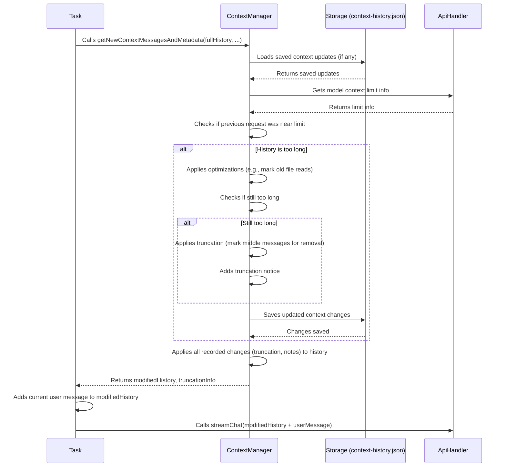

# Chapter 6: ContextManager

In the [previous chapter](05_checkpointtracker_.md), we saw how the `CheckpointTracker` provides a safety net by saving snapshots of your files, allowing you to undo changes made by Cline. Now, let's tackle a different kind of limit: the AI's "memory."

Imagine you're having a long conversation with Cline about a complex project. You've discussed requirements, looked at several files, tried different approaches, and now you ask a follow-up question. For the AI to give a relevant answer, it needs to "remember" the important parts of your conversation. But there's a catch: AI models (LLMs) have a limited memory span, called the **context window**.

If the conversation history gets too long, sending it all to the AI can cause errors or become very expensive. How does Cline manage this, ensuring the AI remembers the important stuff without exceeding its limits?

Meet the **`ContextManager`**! Think of it as a **smart librarian** for your conversation history.

**Use Case:** You've been chatting with Cline for an hour, reviewing code in `api.py`, then `database.py`, and then `api.py` again. The conversation is now thousands of words long. You ask Cline to "refactor the authentication logic in `api.py` based on our earlier discussion." The `ContextManager` steps in before this message is sent to the AI. It looks at the long history, realizes it might be too big, maybe removes the *content* of the older `database.py` read (replacing it with a note like "we read database.py here"), and possibly trims some very old messages, ensuring the important initial goal, the recent discussion about `api.py`, and your new request all fit within the AI's memory limit.

## The Librarian for AI Memory

The `ContextManager` (`core/context/context-management/ContextManager.ts`) is responsible for preparing the conversation history that gets sent to the AI via the [ApiHandler](04_apihandler_.md). Its main goal is to prevent the history from exceeding the AI model's context window limit, while trying to keep the most important information.

Like a librarian who periodically archives older, less-used books from a shelf to make room for new ones, the `ContextManager` uses several strategies:

1.  **Optimization:** It looks for ways to save space without losing *meaning*. For example, if you read the same file multiple times, it might replace the *content* of older reads with a simple note (like `[[NOTE] This file read has been removed...]`), assuming the most recent read is the relevant one.
2.  **Truncation:** If optimizations aren't enough, it intelligently removes older parts of the conversation. It usually tries to keep the very first message (your initial request) and the most recent messages, removing pairs of user/assistant messages from the middle.
3.  **Persistence:** It remembers the changes it makes (like where it truncated or which file read it replaced with a note) for a specific task. This ensures that future messages in the same conversation are consistently managed.

## How it Works: Preparing the History

The `ContextManager` typically does its work inside the [Task](03_task_.md) object, right before the task sends the messages to the [ApiHandler](04_apihandler_.md).

1.  **Input:** The `Task` gives the `ContextManager` the *full* current conversation history (as a list of messages), information about the AI model being used (specifically its context window size, obtained from the [ApiHandler](04_apihandler_.md)), and sometimes metadata about the previous AI request (like how many tokens it used).
2.  **Processing:** The `ContextManager` analyzes the history:
    *   Checks if the previous request nearly filled the context window.
    *   If yes, it first tries optimizations (like replacing old file reads).
    *   If still too large, it calculates how much to truncate (e.g., remove half of the older messages).
    *   It records these changes (optimizations/truncation points) internally.
3.  **Output:** The `ContextManager` returns a potentially modified list of messages that is ready to be sent to the AI and fits within the context window limit. It also returns information about any truncation it performed.

## Key Mechanisms in Action

Let's look at the main strategies the `ContextManager` uses.

**1. Checking the Limit**

First, it needs to know if action is required. It uses information from the previous AI request and the current model's limits.

```typescript
// Inside ContextManager.ts (Simplified logic in getNewContextMessagesAndMetadata)

// Get info about the previous request's token usage
const { tokensIn, tokensOut, ... } = JSON.parse(previousRequest.text);
const totalTokens = tokensIn + tokensOut + ...;

// Get the current model's limits from the ApiHandler
const { maxAllowedSize } = getContextWindowInfo(api); // From context-window-utils.ts

// Is the previous request close to the limit?
if (totalTokens >= maxAllowedSize) {
  // ---> Time to optimize or truncate! <---
}
```

This check determines if the context is getting dangerously full. `getContextWindowInfo` helps understand the specific model's capacity.

**2. Optimization: Replacing Repeated File Reads**

If the context is too full, the first step is often optimization. The `ContextManager` looks for patterns like multiple `read_file` tool calls or file content included in messages.

```typescript
// Inside ContextManager.ts (Simplified logic in applyContextOptimizations)

// 1. Find all places where files were read (e.g., read_file tool, <file_content> tags)
const [fileReadIndices, /*...*/] = this.getPossibleDuplicateFileReads(
  apiMessages, startFromIndex
);
// fileReadIndices might look like:
// Map { 'src/utils.py' => [ [index1, type1, ...], [index5, type5, ...] ] }

// 2. Apply changes: If a file was read multiple times, replace older reads
// (This happens inside applyFileReadContextHistoryUpdates)
// It iterates through fileReadIndices. If a file has multiple entries,
// it keeps the *last* one and marks older ones for replacement.

// For message at index1 (an older read of 'src/utils.py'):
// Add an update: Replace original file content with formatResponse.duplicateFileReadNotice()

// 3. Record these changes internally (in this.contextHistoryUpdates)
// this.contextHistoryUpdates.set(messageIndex, [type, Map { blockIndex => [timestamp, "text", [replacementText], []] }]);
```

This logic identifies redundant information (older file reads) and replaces them with a short placeholder note, freeing up space. The actual replacement happens later when the history is assembled.

**3. Truncation: Removing Older Messages**

If optimization isn't enough, the `ContextManager` resorts to truncation.

```typescript
// Inside ContextManager.ts (Simplified logic in getNewContextMessagesAndMetadata)

if (needToTruncate) { // Check if optimizations saved enough space
  // 1. Add a note to the *first assistant message* (index 1)
  // indicating that some history was removed.
  this.applyStandardContextTruncationNoticeChange(timestamp);
  // Adds update: Replace original text with formatResponse.contextTruncationNotice()

  // 2. Calculate the range of messages to remove
  conversationHistoryDeletedRange = this.getNextTruncationRange(
    apiConversationHistory,
    conversationHistoryDeletedRange, // Previous range, if any
    keep // e.g., "half" or "quarter"
  );
  // getNextTruncationRange keeps index 0 (user) & 1 (assistant),
  // and calculates a range [start, end] in the middle to remove.

  updatedConversationHistoryDeletedRange = true;
}
```

This removes pairs of user/assistant messages from the middle of the conversation, preserving the beginning and the end. It also adds a standard note to inform the AI that truncation occurred.

**4. Applying the Changes (`applyContextHistoryUpdates`)**

The optimizations and truncation decisions are stored internally in `this.contextHistoryUpdates`. When the [Task](03_task_.md) finally asks for the messages to send to the AI, this method applies the stored changes.

```typescript
// Inside ContextManager.ts (Simplified)
private applyContextHistoryUpdates(
  messages: MessageParam[],
  startFromIndex: number // Where truncation *might* have started
): MessageParam[] {
  // 1. Get the messages that weren't truncated
  const firstChunk = messages.slice(0, 2); // Keep first pair
  const secondChunk = messages.slice(startFromIndex); // Keep recent messages
  const messagesToUpdate = [...firstChunk, ...secondChunk];
  const originalIndices = [0, 1, ...indices_from_startFromIndex]; // Track original indices

  // 2. Iterate through the messages we're keeping
  for (let i = 0; i < messagesToUpdate.length; i++) {
    const originalIndex = originalIndices[i];
    const innerTuple = this.contextHistoryUpdates.get(originalIndex);

    // 3. If there are stored changes for this message...
    if (innerTuple) {
      messagesToUpdate[i] = cloneDeep(messagesToUpdate[i]); // Make a copy to modify
      const innerMap = innerTuple[1]; // Changes keyed by block index

      for (const [blockIndex, changes] of innerMap) {
        // 4. Apply the *latest* recorded change for this block
        const latestChange = changes[changes.length - 1];
        if (latestChange[1] === "text") {
          // Find the text block at blockIndex and update its content
          // E.g., replace file content with "[[NOTE]...]"
          // E.g., replace first assistant message with truncation notice
        }
      }
    }
  }
  return messagesToUpdate; // Return the modified list
}
```

This method takes the original history, applies the truncation based on `startFromIndex`, and then overlays any stored modifications (like replaced file reads or the truncation notice) before returning the final list of messages for the AI.

**5. Persistence (`saveContextHistory`)**

The recorded changes (`this.contextHistoryUpdates`) are saved to a file (`context-history.json`) within the task's directory. This ensures that if the conversation continues, the context management decisions (like which messages were truncated or which file reads were replaced) are remembered and applied consistently.

## Example Usage by the Task

Here’s how the [Task](03_task_.md) uses the `ContextManager`:

```typescript
// Inside core/task/index.ts (Simplified runTask method)
async runTask() {
  // ... other setup ...
  this.contextManager = new ContextManager(/*...*/);
  // Load previously saved context updates for this task
  await this.contextManager.initializeContextHistory(this.taskDirectory);

  // ---> Ask ContextManager to prepare the history <---
  const {
    truncatedConversationHistory, // The modified messages list
    conversationHistoryDeletedRange, // Info about truncation
    updatedConversationHistoryDeletedRange, // Did truncation happen now?
  } = await this.contextManager.getNewContextMessagesAndMetadata(
    this.apiConversationHistory, // Full history
    this.clineMessages, // UI messages (used for metadata)
    this.api, // ApiHandler (for model info)
    this.conversationHistoryDeletedRange, // Previous truncation range
    this.previousApiReqIndex, // Index of previous request
    this.taskDirectory, // Where to save updates
  );

  // Update task's record of truncation if needed
  if (updatedConversationHistoryDeletedRange) {
    this.conversationHistoryDeletedRange = conversationHistoryDeletedRange;
  }

  // Add the user's *new* message to the prepared history
  const apiMessages = [...truncatedConversationHistory, { role: 'user', content: this.userMessage }];

  // ---> Send the prepared history to the AI <---
  const stream = this.api.streamChat(apiMessages, /* ... */);

  // ... process stream ...
}
```

The `Task` calls `getNewContextMessagesAndMetadata`, receives the potentially modified history (`truncatedConversationHistory`), adds the current user message, and sends *that* list to the [ApiHandler](04_apihandler_.md).

## Visualizing the Flow

Here's a diagram showing the `ContextManager` in action when a [Task](03_task_.md) prepares to call the AI:



This shows the `ContextManager` acting as a filter and modifier before the history reaches the [ApiHandler](04_apihandler_.md).

## Conclusion

The `ContextManager` is the essential "librarian" that manages the conversation history sent to the AI. It ensures that Cline respects the AI's context window limitations by:

*   **Optimizing** the history (e.g., replacing redundant file reads with notes).
*   **Truncating** older messages when necessary, while preserving the start and end of the conversation.
*   **Applying** these changes consistently throughout a task's lifecycle.
*   **Persisting** these changes to disk (`context-history.json`).

By intelligently managing the context, the `ContextManager` helps keep conversations with Cline coherent and prevents errors caused by exceeding the AI's memory limits.

Now that we understand how Cline manages the information sent *to* the AI, what about executing commands *in* your system, like running shell commands?

**Next Up:** [Chapter 7: TerminalManager](07_terminalmanager_.md)

---

Generated by [AI Codebase Knowledge Builder](https://github.com/The-Pocket/Tutorial-Codebase-Knowledge)