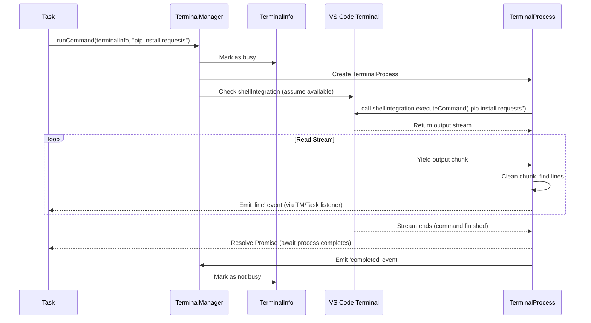

# Chapter 7: TerminalManager

In the [previous chapter](06_contextmanager_.md), we learned how the `ContextManager` acts like a smart librarian, preparing the conversation history to fit within the AI's memory limits. But what happens when the AI doesn't just want to *talk* about code, but actually wants to *run* commands on your system?

**Use Case:** Imagine you ask Cline: "Install the `requests` library for Python using pip." The AI understands this means running the command `pip install requests` in your project's terminal. How does Cline actually type this command into a terminal and read the result (like "Successfully installed requests...") to know if it worked?

That's the job of the **`TerminalManager`**! Think of it as Cline's **remote control for VS Code's built-in terminal**.

## The Remote Control for Your Shell

The `TerminalManager` (`integrations/terminal/TerminalManager.ts`) is responsible for all interactions with the integrated terminals inside VS Code. It allows Cline's backend logic (usually within a [Task](03_task_.md)) to:

1.  **Find or Create Terminals:** It can reuse an existing terminal that Cline previously opened, or create a brand new one if needed, often making sure it's in the correct project directory (cwd - current working directory).
2.  **Run Commands:** It takes a command string (like `"pip install requests"`) and sends it to the chosen terminal to be executed by the shell (like Bash, Zsh, or PowerShell).
3.  **Capture Output:** It listens to the terminal to capture the text output produced by the command.
4.  **Track Execution (Shell Integration):** Whenever possible, it uses a special VS Code feature called "shell integration." This helps it know exactly when a command starts, when it finishes, and reliably captures *only* the output belonging to that specific command. If shell integration isn't available (e.g., on older VS Code versions or unsupported shells), it uses simpler methods but might be less precise.

Essentially, `TerminalManager` lets the AI "type" commands into your terminal and "read" the screen to see what happened.

## What's Shell Integration?

Modern versions of VS Code have a feature called "shell integration." When enabled (which is usually automatic for common shells like Bash, Zsh, PowerShell), the shell sends special invisible signals back to VS Code around the commands you run.

Think of it like stage cues in a play:

*   `[Signal: Prompt Ready]`
*   User types: `git status`
*   `[Signal: Command Start]`
*   *(Command output appears)*
*   `[Signal: Command End (Exit Code: 0)]`
*   `[Signal: Prompt Ready]`

The `TerminalManager` listens for these "signals." When it uses shell integration, it knows precisely when the command (`git status` in this case) starts and ends, and it can capture exactly the output generated between those signals. This is much more reliable than just guessing based on timing or looking for the next prompt.

If shell integration isn't available, `TerminalManager` falls back to just sending the command text (`terminal.sendText(...)`) and might have trouble distinguishing the command's output from other things in the terminal or knowing exactly when it finished.

## How the Task Uses the TerminalManager

Let's revisit our `pip install requests` example. Inside a [Task](03_task_.md) that needs to run this command:

```typescript
// Inside a Task method (simplified)
async function installPipPackage(packageName: string) {
  // 1. Get the TerminalManager instance (usually created in Task constructor)
  const terminalManager = this.terminalManager; // Assuming 'this.terminalManager' exists

  // 2. Get the current working directory for the project
  const projectDir = vscode.workspace.workspaceFolders?.[0].uri.fsPath;
  if (!projectDir) {
     throw new Error("No project directory found.");
  }

  // 3. Ask TerminalManager for a suitable terminal
  const terminalInfo = await terminalManager.getOrCreateTerminal(projectDir);

  // 4. Run the command and get a 'TerminalProcess' object
  const command = `pip install ${packageName}`;
  const process = terminalManager.runCommand(terminalInfo, command);

  // 5. Listen for output line by line (optional)
  let output = "";
  process.on('line', (line) => {
    console.log("Terminal:", line);
    output += line + "\n";
    // Maybe send this partial output to the UI?
    this.postMessageToWebview({ type: 'say', /* ... */ });
  });

  // 6. Wait for the command to complete (or continue in background)
  try {
    await process; // Wait until the command finishes
    console.log("Command finished successfully!");
    // The AI needs to know the result
    return `Command completed. Output:\n${output}`;
  } catch (error) {
    console.error("Command failed:", error);
    return `Command failed. Error:\n${error}`;
  }
}

// Later, the Task might call:
// const result = await installPipPackage("requests");
// And include 'result' in its next message to the AI.
```

**Explanation:**

1.  The `Task` has an instance of `TerminalManager`.
2.  It figures out the correct directory (`cwd`) where the command should run.
3.  `terminalManager.getOrCreateTerminal(projectDir)` either finds an existing terminal already in that directory and not busy, or creates a new one. It returns info about the terminal (`terminalInfo`).
4.  `terminalManager.runCommand(terminalInfo, command)` tells the chosen terminal to execute `pip install requests`. It returns a special `TerminalProcess` object.
5.  The `TerminalProcess` object lets you listen for output as it happens (using `.on('line', ...)`). This is useful for showing progress in the UI.
6.  `await process;` waits for the command to fully complete (using shell integration if possible). If it finishes successfully, the `await` completes normally. If there's an error (like the command failing), it throws an error. The captured `output` can then be processed or sent back to the AI.

## Under the Hood: How `runCommand` Works

Let's trace the main steps when `terminalManager.runCommand` is called.

1.  **Mark Terminal Busy:** The `TerminalManager` marks the chosen terminal (`terminalInfo`) as busy so it won't be picked again until this command finishes.
2.  **Create `TerminalProcess`:** It creates a new `TerminalProcess` object. This object will handle listening to the terminal's output and manage the command's lifecycle.
3.  **Check Shell Integration:** It checks if `terminalInfo.terminal.shellIntegration` is available.
4.  **Wait (Maybe):** If shell integration isn't *immediately* available on a new terminal, it waits for a short period (e.g., up to `shellIntegrationTimeout` milliseconds, configurable in settings) hoping it will activate.
5.  **Execute:**
    *   **With Shell Integration:** If available, it calls `terminal.shellIntegration.executeCommand(command)`. This returns a way to read the command's output as a stream (`AsyncIterable<string>`). The `TerminalProcess` then reads this stream chunk by chunk. It knows exactly when the stream ends, meaning the command finished.
    *   **Without Shell Integration (Fallback):** If shell integration isn't available or times out, it calls `terminal.sendText(command, true)` (the `true` means "press Enter"). The `TerminalProcess` *cannot* reliably know when the command finishes or perfectly separate its output in this mode. It emits a special `no_shell_integration` event and the `TerminalManager` typically won't reuse this terminal again, just in case a long-running process was started.
6.  **Process Output:** The `TerminalProcess` receives raw data, cleans it up (e.g., removes color codes using `stripAnsi`), detects line breaks, and emits `line` events.
7.  **Completion:** When the command finishes (detected via the stream ending with shell integration, or just assumed after a short delay in the fallback), the `TerminalProcess` emits `completed` and resolves the promise (`await process;` finishes).
8.  **Mark Terminal Free:** Once the process completes, the `TerminalManager` marks the terminal as no longer busy.

### Visualizing the Flow (with Shell Integration)



## Code Snippets

Let's look at simplified code from the relevant files.

**`TerminalManager.ts` - Getting a Terminal**

```typescript
// Simplified from integrations/terminal/TerminalManager.ts
class TerminalManager {
  // ... other properties ...

  async getOrCreateTerminal(cwd: string): Promise<TerminalInfo> {
    const terminals = TerminalRegistry.getAllTerminals();

    // Try to find an existing, non-busy terminal in the right directory
    const matchingTerminal = terminals.find((t) => {
      const terminalCwd = t.terminal.shellIntegration?.cwd;
      return !t.busy && terminalCwd && arePathsEqual(cwd, terminalCwd.fsPath);
    });
    if (matchingTerminal) return matchingTerminal;

    // Try to find *any* non-busy terminal and change its directory
    const availableTerminal = terminals.find((t) => !t.busy);
    if (availableTerminal) {
      await this.runCommand(availableTerminal, `cd "${cwd}"`); // Run 'cd' command
      return availableTerminal;
    }

    // Otherwise, create a new one
    return TerminalRegistry.createTerminal(cwd);
  }
  // ... runCommand method ...
}
```

This shows the logic for reusing terminals when possible. `TerminalRegistry` (shown below) helps keep track of the terminals Cline is aware of.

**`TerminalManager.ts` - Running the Command**

```typescript
// Simplified from integrations/terminal/TerminalManager.ts
class TerminalManager {
  // ... other properties ...
  private processes: Map<number, TerminalProcess> = new Map();
  private shellIntegrationTimeout: number = 4000; // Configurable

  runCommand(terminalInfo: TerminalInfo, command: string): TerminalProcessResultPromise {
    terminalInfo.busy = true;
    const process = new TerminalProcess(); // Create the handler
    this.processes.set(terminalInfo.id, process);

    process.once("completed", () => { terminalInfo.busy = false; });
    process.once("no_shell_integration", () => {
        TerminalRegistry.removeTerminal(terminalInfo.id); // Don't reuse if no integration
        // ... cleanup ...
    });

    // Wrapper promise for await process;
    const promise = new Promise<void>((resolve, reject) => { /* ... */ });

    if (terminalInfo.terminal.shellIntegration) {
        // Integration available: Run immediately
        process.run(terminalInfo.terminal, command);
    } else {
        // Integration not ready: Wait briefly then run
        pWaitFor(() => terminalInfo.terminal.shellIntegration !== undefined, {
            timeout: this.shellIntegrationTimeout,
        }).finally(() => {
            // Run command using process.run, which handles both cases internally
            this.processes.get(terminalInfo.id)?.run(terminalInfo.terminal, command);
        });
    }

    return mergePromise(process, promise); // Combines process events and promise
  }
  // ... other methods ...
}
```

This shows how `runCommand` sets up the `TerminalProcess` and handles the check (and wait) for shell integration before calling `process.run`.

**`TerminalProcess.ts` - Executing and Reading Output**

```typescript
// Simplified from integrations/terminal/TerminalProcess.ts
class TerminalProcess extends EventEmitter<TerminalProcessEvents> {
  // ... other properties ...

  async run(terminal: vscode.Terminal, command: string) {
    if (terminal.shellIntegration?.executeCommand) {
      // --- Shell Integration Path ---
      const execution = terminal.shellIntegration.executeCommand(command);
      const stream = execution.read();
      try {
        for await (let data of stream) {
          const cleanedData = stripAnsi(data); // Remove color codes etc.
          // ... (logic to handle first chunk artifacts, ^C, etc.) ...
          this.fullOutput += cleanedData;
          if (this.isListening) {
            this.emitIfEol(cleanedData); // Emit line events
          }
        }
        this.emitRemainingBufferIfListening(); // Emit any trailing output
      } catch (error) {
        this.emit("error", error); // Handle stream errors
      } finally {
        this.emit("completed"); // Command finished
        this.emit("continue"); // Resolve the promise
      }
    } else {
      // --- Fallback Path ---
      terminal.sendText(command, true); // Just send text + Enter
      // We can't reliably know when it finishes here.
      this.emit("completed"); // Assume completion (might be wrong)
      this.emit("continue");
      this.emit("no_shell_integration"); // Signal that we used fallback
    }
  }

  // Helper to emit full lines
  private emitIfEol(chunk: string) { /* ... finds '\n' and emits 'line' ... */ }

  // Called if user does `process.continue()` to stop listening early
  continue() { /* ... stops emitting 'line', emits 'continue' ... */ }

  // Gets output accumulated since the last time output was processed
  getUnretrievedOutput(): string { /* ... returns buffer ... */ }
}
```

This shows the core `run` method inside `TerminalProcess` with the two paths: using the reliable `shellIntegration.executeCommand` stream or the less reliable `sendText` fallback.

**`TerminalRegistry.ts` - Tracking Terminals**

```typescript
// Simplified from integrations/terminal/TerminalRegistry.ts
export class TerminalRegistry {
	private static terminals: TerminalInfo[] = [];
	private static nextTerminalId = 1;

	static createTerminal(cwd?: string | vscode.Uri): TerminalInfo {
		const terminal = vscode.window.createTerminal({ cwd, name: "Cline", /*...*/ });
		const newInfo: TerminalInfo = {
			terminal,
			busy: false,
			lastCommand: "",
			id: this.nextTerminalId++,
		};
		this.terminals.push(newInfo);
		// Listen for terminal close events to remove it from the registry
		vscode.window.onDidCloseTerminal(closedTerminal => {
			if (closedTerminal === terminal) {
				this.removeTerminal(newInfo.id);
			}
		});
		return newInfo;
	}

	static getTerminal(id: number): TerminalInfo | undefined {
		return this.terminals.find((t) => t.id === id);
	}

	static removeTerminal(id: number) {
		this.terminals = this.terminals.filter((t) => t.id !== id);
	}

	static getAllTerminals(): TerminalInfo[] {
		// Filter out any terminals that might have been closed unexpectedly
		this.terminals = this.terminals.filter(t => t.terminal.exitStatus === undefined);
		return this.terminals;
	}
}
```

This registry provides simple functions to create new terminals, find existing ones by ID, and keep the list up-to-date by removing closed terminals.

## Conclusion

The `TerminalManager` is Cline's interface to your command line world within VS Code. It acts as a remote control, allowing the AI (via the [Task](03_task_.md)) to:

*   Intelligently **reuse or create** integrated terminals.
*   **Execute shell commands** requested by the AI.
*   Reliably **capture the command's output**, preferably using VS Code's **shell integration**.
*   Provide **fallbacks** when shell integration isn't available.

This capability is crucial for letting Cline perform actions like installing packages, running scripts, checking code status with Git, and much more, making it a powerful coding assistant.

While `TerminalManager` handles direct shell command execution, Cline also has a more structured way to interact with tools and services, especially external ones. Let's explore that next.

**Next Up:** [Chapter 8: McpHub (Model Context Protocol Hub)](08_mcphub__model_context_protocol_hub__.md)

---

Generated by [AI Codebase Knowledge Builder](https://github.com/The-Pocket/Tutorial-Codebase-Knowledge)