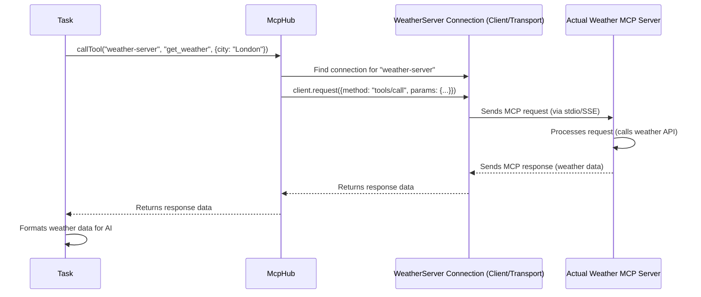

# Chapter 8: McpHub (Model Context Protocol Hub)

In the [previous chapter](07_terminalmanager_.md), we saw how the `TerminalManager` lets Cline run commands directly in your VS Code terminal, like installing packages or running scripts. But what if Cline needs more specialized capabilities, like getting the current weather, searching a specific database, or interacting with a service like GitHub in a structured way? Running shell commands for everything isn't always the best or most reliable approach.

We need a way for Cline to connect to other, potentially complex, external tools and data sources.

**Use Case:** Imagine you ask Cline, "What's the current weather in London?". Cline itself doesn't have a built-in weather sensor. However, maybe you (or someone else) has set up a separate small program (a "server") that *can* get weather data. How does Cline discover this weather program, connect to it, ask it for the weather in London, and get the answer back?

That's where the **`McpHub`** comes in! Think of it as Cline's **central switchboard or directory for specialized external services**.

## What is McpHub?

The `McpHub` (`services/mcp/McpHub.ts`) is the component responsible for managing connections to external services that speak the "Model Context Protocol" (MCP). These external services are called **MCP Servers**.

Think of it like this:

*   **MCP Servers:** These are like specialized businesses offering specific services (e.g., a Weather Service, a GitHub Issue Tracker Service, a Database Query Service). They run independently from Cline.
*   **Model Context Protocol (MCP):** This is like a standard business language or set of rules that all these specialized businesses agree to use when talking to Cline. It defines *how* Cline can ask for services and *how* the servers should respond.
*   **`McpHub`:** This is the central directory and switchboard operator within Cline. It keeps a list of known MCP Servers (from a configuration file), knows how to contact them, checks if they are open for business (connected), asks them what services (tools/resources) they offer, and connects Cline's requests to the right server.

## MCP Servers: The Specialists

An MCP Server is typically a small, standalone application. It could be running on your computer or even somewhere else on a network. Its job is to provide specific capabilities to Cline, advertised as:

*   **Tools:** Actions the server can perform, often taking parameters (e.g., a `get_weather` tool that takes a `city` parameter).
*   **Resources:** Data the server can provide, identified by a unique name or URI (e.g., a `weather://London/current` resource).

These servers communicate with Cline using the Model Context Protocol, usually over one of two methods:

1.  **stdio (Standard Input/Output):** Cline starts the server program as a separate process and talks to it by writing to its input and reading from its output (like typing commands and seeing results in a basic terminal, but structured).
2.  **SSE (Server-Sent Events):** Cline connects to a web address (URL) where the server is listening, and they exchange messages over HTTP using a specific event-based format.

## The Role of McpHub: The Switchboard Operator

The `McpHub` manages the entire lifecycle of Cline's interaction with these external servers:

1.  **Reads the Directory:** It reads a configuration file (usually `mcp-settings.json` in the extension's global storage) that lists all the MCP servers Cline should know about, how to connect to them (stdio command or SSE URL), and any special settings (like API keys needed by the server, passed as environment variables).
2.  **Establishes Connections:** For each server listed in the configuration (that isn't marked as disabled), `McpHub` tries to establish a connection using the specified method (stdio or SSE).
3.  **Monitors Status:** It keeps track of whether each server is `connecting`, `connected`, or `disconnected`. If a connection fails or drops, it records the error.
4.  **Discovers Capabilities:** Once connected to a server, `McpHub` asks it: "What tools do you offer?" (`tools/list`) and "What resources do you provide?" (`resources/list`, `resources/templates/list`).
5.  **Updates Cline's Knowledge:** It takes the list of tools and resources received from all connected servers and makes them available to the AI, usually by injecting descriptions into the main [System Prompt](core/prompts/system.ts). This lets the AI know what external capabilities are available.
6.  **Handles Requests:** When the AI decides to use an external capability (by outputting `<use_mcp_tool>` or `<access_mcp_resource>` tags), the [Task](03_task_.md) passes this request to the `McpHub`. The `McpHub` finds the correct connected server and forwards the request (e.g., calls the `get_weather` tool with the `city` parameter).
7.  **Relays Responses:** When the MCP server sends back the result (e.g., the weather data), `McpHub` passes this response back to the [Task](03_task_.md), which then gives it to the AI.
8.  **Notifies the UI:** It sends messages to the [WebviewProvider](01_webviewprovider_.md) to update the UI about the status of MCP servers (connected/disconnected/errors) and the tools available.

## How it Works: Connecting to a Weather Server

Let's follow the "What's the weather in London?" example.

**1. Configuration (`mcp-settings.json`)**

First, `McpHub` needs to know about the weather server. This information is stored in a JSON file.

```json
// Simplified mcp-settings.json
{
  "mcpServers": {
    "weather-server": { // A unique name for this server
      "command": "node", // Program to run (for stdio)
      "args": ["/path/to/weather-server/build/index.js"], // Path to server script
      "env": { // Environment variables for the server
        "OPENWEATHER_API_KEY": "user-provided-key"
      },
      "disabled": false // Set to true to temporarily disable
    }
    // ... potentially other servers (stdio or sse) ...
  }
}
```

*   This entry tells `McpHub` there's a server named "weather-server".
*   It's a `stdio` server, started by running `node` with the specified script.
*   It needs an API key passed via the `OPENWEATHER_API_KEY` environment variable.
*   It's currently enabled (`disabled: false`).

**2. Connection (`McpHub.connectToServer`)**

When Cline starts, or when the settings file changes, `McpHub` reads this config. For "weather-server", it performs steps similar to this:

```typescript
// Simplified logic within McpHub.ts connectToServer for stdio

// 1. Create an MCP client instance
const client = new Client(/* Cline info */);

// 2. Create a stdio transport based on config
const transport = new StdioClientTransport({
  command: config.command, // "node"
  args: config.args,       // ["/path/.../index.js"]
  env: config.env,         // { OPENWEATHER_API_KEY: ... }
  stderr: "pipe"           // Capture errors
});

// 3. Set up listeners for errors/closure
transport.onerror = (error) => { /* update status to disconnected, store error */ };
transport.onclose = () => { /* update status to disconnected */ };

// 4. Store the connection attempt
const connection = { server: { name, config, status: "connecting" }, client, transport };
this.connections.push(connection);

// 5. Start the server process and connect
await client.connect(transport);

// 6. If successful, update status
connection.server.status = "connected";

// 7. Fetch capabilities (see next step)
await this.fetchCapabilities(connection);
```

This code uses the `@modelcontextprotocol/sdk` library to create a client and a transport layer configured for stdio. It then attempts the connection and updates the server's status. If it were an SSE server, `SseClientTransport` would be used with the URL from the config instead.

**3. Discovery (`McpHub.fetchToolsList`, etc.)**

Once connected, `McpHub` asks the server about its capabilities.

```typescript
// Simplified logic in McpHub.ts fetchToolsList

async fetchToolsList(serverName: string): Promise<McpTool[]> {
  const connection = this.connections.find(c => c.server.name === serverName);
  if (!connection) return [];

  try {
    // Ask the server: "What tools do you have?"
    const response = await connection.client.request(
      { method: "tools/list" },
      ListToolsResultSchema // Expected response format
    );
    // Store the list on the connection.server object
    connection.server.tools = response?.tools || [];
    return connection.server.tools;
  } catch (error) {
    console.error(`Failed to get tools for ${serverName}:`, error);
    return [];
  }
}
```

This sends a standard MCP request (`tools/list`) to the server using the established client connection. The weather server would respond with details about its `get_weather` tool (name, description, expected input parameters). `McpHub` stores this information.

**4. Usage (`Task` calls `McpHub.callTool`)**

Later, the AI generates a message containing:

```xml
<use_mcp_tool>
  <server_name>weather-server</server_name>
  <tool_name>get_weather</tool_name>
  <arguments>
    { "city": "London" }
  </arguments>
</use_mcp_tool>
```

The [Task](03_task_.md) parses this and calls `McpHub`'s method to handle it:

```typescript
// Simplified Task logic
async handleToolCall(toolInfo) {
  if (toolInfo.toolName === 'use_mcp_tool') {
    const serverName = toolInfo.params.server_name;
    const mcpToolName = toolInfo.params.tool_name;
    const args = JSON.parse(toolInfo.params.arguments);

    // ---> Ask McpHub to call the tool <---
    const result = await this.mcpHub.callTool(serverName, mcpToolName, args);

    // Process the result from the MCP server
    // ... format 'result' and add to conversation for AI ...
  }
  // ... other tool handling ...
}
```

Inside `McpHub.callTool`:

```typescript
// Simplified logic in McpHub.ts callTool

async callTool(serverName, toolName, args) {
  const connection = this.connections.find(c => c.server.name === serverName);
  if (!connection || connection.server.status !== 'connected') {
    throw new Error(`Server ${serverName} not connected.`);
  }

  // Send the request to the specific server
  const response = await connection.client.request(
    {
      method: "tools/call",
      params: { name: toolName, arguments: args }
    },
    CallToolResultSchema, // Expected response format
    { timeout: /* configured timeout */ }
  );

  return response; // Return the result from the MCP server
}
```

`McpHub` finds the correct connection ("weather-server"), sends the `tools/call` request with the tool name (`get_weather`) and arguments (`{ "city": "London" }`) to that specific server, waits for the response (the weather data), and returns it to the `Task`.

## Visualizing the Tool Call



This diagram shows `McpHub` acting as the intermediary, routing the `Task`'s request to the correct external server via its specific connection object.

## Conclusion

The `McpHub` is Cline's central nervous system for interacting with specialized external services (MCP Servers). It acts like a switchboard operator:

*   It reads a **directory** (`mcp-settings.json`) of available servers.
*   It **connects** to these servers using stdio or SSE.
*   It **discovers** the tools and resources each server offers.
*   It **routes** requests from the [Task](03_task_.md) (originating from the AI) to the appropriate server.
*   It manages server **status** and updates the UI.

By using the Model Context Protocol (MCP) as a standard language and `McpHub` as the central manager, Cline can be extended with a wide variety of external capabilities without needing to hardcode support for each one individually.

Now that we've seen how Cline connects to external tools via MCP, how does it handle other types of structured communication, especially for more complex, built-in interactions?

**Next Up:** [Chapter 9: GrpcHandler / ServiceRegistry](09_grpchandler___serviceregistry_.md)

---

Generated by [AI Codebase Knowledge Builder](https://github.com/The-Pocket/Tutorial-Codebase-Knowledge)