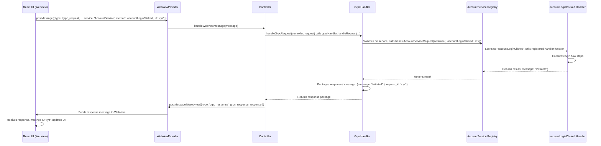

# Chapter 9: GrpcHandler / ServiceRegistry

In the [previous chapter](08_mcphub__model_context_protocol_hub__.md), we learned how the `McpHub` acts as a switchboard for connecting Cline to specialized external tools using the Model Context Protocol. That's great for extending Cline's capabilities with outside services.

But what about communication *within* Cline itself? Specifically, how does the user interface (the React code running in the [WebviewProvider](01_webviewprovider_.md)) ask the main extension backend (the [Controller](02_controller_.md) and its helpers) to perform specific actions in a structured way? For example, how does clicking a button in the UI tell the backend *exactly* which file to read, or which account action to trigger?

We need a reliable and organized way for the UI (acting like a client) to make specific requests to the backend (acting like a server), like calling a function with arguments.

That's where the **`GrpcHandler`** and **`ServiceRegistry`** come in! Think of them as setting up a very organized internal "phone system" between the UI and the backend.

**Use Case:** Imagine you have a settings panel in Cline's UI with a button labelled "Login". When you click it, the UI needs to tell the backend, "The user clicked the login button, please start the login process." It shouldn't just send a vague message; it needs to call the *specific* backend function responsible for initiating login. `GrpcHandler` and `ServiceRegistry` provide the mechanism for this precise communication.

## What's This "gRPC" Thing? (Simplified)

You might hear the term "gRPC". At its core, gRPC is a technology often used for efficient communication between different software components, especially across networks. It involves defining a strict "contract" (using files usually ending in `.proto`) that specifies exactly what functions (methods) are available, what information (message) they need, and what they return.

**Important:** Cline uses the *concepts* and *structure* of gRPC, but it doesn't use it directly over the network between the UI and backend. Instead, it sends gRPC-structured messages back and forth using the standard [WebviewProvider](01_webviewprovider_.md) message passing system we learned about in Chapter 1.

Think of it like agreeing on a very specific format for writing letters (the gRPC structure) and then sending those letters through the regular postal service (Webview messaging). This gives us the organization of gRPC without adding network complexity.

## Meet the Phone System Operators

Now, let's look at the Cline components that manage this internal communication:

1.  **`ServiceRegistry` (`core/controller/grpc-service.ts`): The Department Phone Book**
    Imagine a large company (Cline's backend). You wouldn't have just one giant phone list for everyone! You'd likely have separate phone books for different departments: Sales, Engineering, Accounts, etc.

    A `ServiceRegistry` is like one of these **department phone books**. It's created for a specific category of backend functions (a "service"). For example, Cline has registries for:
    *   `account` service (handles login, etc.)
    *   `file` service (handles reading/writing files)
    *   `task` service (handles task-related actions)
    *   `checkpoints` service (handles [CheckpointTracker](05_checkpointtracker_.md) actions)
    *   ...and others.

    Each `ServiceRegistry` holds a list of specific functions ("phone extensions" or methods) available within that service and knows which backend code handles each function.

2.  **`GrpcHandler` (`core/controller/grpc-handler.ts`): The Main Switchboard Operator**
    When a call (a gRPC-style message) comes in from the UI, someone needs to answer it and direct it to the right department and extension. That's the `GrpcHandler`.

    It acts as the **central switchboard**. It receives all incoming `grpc_request` messages from the UI. It looks at the request to see:
    *   Which **service** (department) is being called (e.g., `"cline.AccountService"`)?
    *   Which **method** (extension) within that service is being called (e.g., `"accountLoginClicked"`)?
    *   What **message** (information) is being provided for the function?

    The `GrpcHandler` then uses this information to find the correct `ServiceRegistry` (department phone book) and tells it to execute the requested method (connect the call to the right extension), passing along the message data. It then waits for the result and sends it back to the UI.

## How it Works: Clicking the "Login" Button

Let's trace the "Login" button click use case:

1.  **UI Action:** You click the "Login" button in the Cline Webview UI.
2.  **UI Creates Request:** The React code knows this corresponds to the `accountLoginClicked` method in the `cline.AccountService`. It constructs a message (using helper code generated from `.proto` files, like `shared/proto/account.ts`):

    ```javascript
    // Simplified UI-side code (React/TypeScript)
    const request = {
      service: "cline.AccountService", // Target service
      method: "accountLoginClicked",   // Target method
      message: {}, // No extra data needed for this method
      request_id: generateUniqueId(), // ID to match response later
    };

    // Send via standard webview messaging
    vscode.postMessage({ type: "grpc_request", grpc_request: request });
    ```
    The UI sends this structured request through the normal `postMessage` channel.

3.  **WebviewProvider Relays:** The [WebviewProvider](01_webviewprovider_.md) receives this message.
4.  **Controller Receives:** The [WebviewProvider](01_webviewprovider_.md) passes it to the [Controller](02_controller_.md)'s `handleWebviewMessage` method.
5.  **Controller Delegates to gRPC Handler:** The `Controller` sees the message type is `"grpc_request"` and calls a dedicated function to handle it: `handleGrpcRequest`.

    ```typescript
    // Inside core/controller/index.ts (Simplified Controller)
    async handleWebviewMessage(message: WebviewMessage) {
      switch (message.type) {
        // ... other message types ...
        case "grpc_request":
          await handleGrpcRequest(this, message.grpc_request); // Pass to gRPC helper
          break;
      }
    }
    ```

6.  **`handleGrpcRequest` Uses `GrpcHandler`:** This function creates the main switchboard operator (`GrpcHandler`) and asks it to handle the request.

    ```typescript
    // Inside core/controller/grpc-handler.ts (Simplified)
    export async function handleGrpcRequest(
      controller: Controller,
      request: { service: string; method: string; message: any; request_id: string },
    ) {
      try {
        const grpcHandler = new GrpcHandler(controller); // Create the operator
        // Ask the operator to process the request
        const response = await grpcHandler.handleRequest(
           request.service, request.method, request.message, request.request_id
        );
        // Send the result back to the UI
        await controller.postMessageToWebview({ type: "grpc_response", grpc_response: response });
      } catch (error) { /* ... send error response ... */ }
    }
    ```

7.  **`GrpcHandler` Routes the Call:** The `GrpcHandler`'s `handleRequest` method uses a `switch` statement based on the `service` name.

    ```typescript
    // Inside core/controller/grpc-handler.ts (Simplified GrpcHandler class)
    class GrpcHandler {
      // ... constructor ...
      async handleRequest(service, method, message, requestId) {
        try {
          let responseMessage;
          switch (service) {
            // ---> Match the service name <---
            case "cline.AccountService":
              // ---> Call the specific handler for the Account service <---
              responseMessage = await handleAccountServiceRequest(this.controller, method, message);
              break;
            case "cline.FileService":
              responseMessage = await handleFileServiceRequest(this.controller, method, message);
              break;
            // ... cases for other services (Task, Checkpoints, etc.) ...
            default:
              throw new Error(`Unknown service: ${service}`);
          }
          // Package successful response
          return { message: responseMessage, request_id: requestId };
        } catch (error) { /* ... package error response ... */ }
      }
    }
    ```
    It finds the case for `"cline.AccountService"` and calls `handleAccountServiceRequest`, passing along the `method` ("accountLoginClicked") and the `message` ({}).

8.  **Service Handler Uses `ServiceRegistry`:** The `handleAccountServiceRequest` function (defined in `core/controller/account/index.ts`) was created using a `ServiceRegistry`. It uses this registry to look up the specific function registered for the `"accountLoginClicked"` method.

    ```typescript
    // Inside core/controller/account/index.ts (Simplified setup)
    import { createServiceRegistry } from "../grpc-service";
    import { registerAllMethods } from "./methods"; // Where methods are defined

    // Create the 'Account' department phone book
    const accountService = createServiceRegistry("account");

    // Export a function that uses the phone book to handle requests
    export const handleAccountServiceRequest = accountService.handleRequest;

    // Automatically register all known methods from methods.ts
    registerAllMethods();

    // --- Inside core/controller/account/methods.ts ---
    // import { registerMethod } from "./index"; // Get the registration function
    // import { /* Controller types */ } from "../../index";
    // import { /* Account logic */ } from "./account-logic";

    // export function registerAllMethods() {
    //   registerMethod("accountLoginClicked", async (controller: Controller, message: any) => {
    //     // This is the actual code that runs!
    //     await performLoginFlow(controller); // Call the backend logic
    //     return { message: "Login flow initiated." }; // Return result
    //   });
    //   // register other account methods...
    // }
    ```
    The `accountService.handleRequest` function (provided by `createServiceRegistry`) internally looks up `"accountLoginClicked"` in its registry and finds the corresponding handler function (the one defined inside `registerAllMethods` in `methods.ts`).

9.  **Backend Logic Executes:** The registered handler function (e.g., `performLoginFlow`) runs. This function contains the actual backend logic to start the login process (like generating a security token and opening the browser).
10. **Result Bubbles Back:** The handler function returns a result (e.g., `{ message: "Login flow initiated." }`). This result goes back through `handleAccountServiceRequest`, to `GrpcHandler`, and finally to `handleGrpcRequest`.
11. **Response Sent to UI:** `handleGrpcRequest` packages the result into a `grpc_response` message and sends it back to the UI using `controller.postMessageToWebview`.

    ```javascript
    // Message sent back to UI
    {
      type: "grpc_response",
      grpc_response: {
        message: { message: "Login flow initiated." }, // The result from the handler
        request_id: "generatedUniqueId()" // The original ID
      }
    }
    ```
12. **UI Receives Response:** The React UI receives this message, matches the `request_id` to the original request, and can update itself (e.g., show a notification that login has started).

## Visualizing the Flow

Here's a sequence diagram showing the process:



This shows the `GrpcHandler` as the central router, dispatching requests to the appropriate `ServiceRegistry`, which then executes the specific backend logic.

## Under the Hood: `ServiceRegistry` and `GrpcHandler` Code

Let's look at the core pieces:

**`core/controller/grpc-service.ts`**

This file defines the generic `ServiceRegistry` and the factory function `createServiceRegistry`.

```typescript
// Simplified ServiceRegistry class
export class ServiceRegistry {
  private serviceName: string;
  // Stores method names -> handler functions
  private methodRegistry: Record<string, ServiceMethodHandler> = {};

  constructor(serviceName: string) { /* ... */ }

  // Adds a method to the "phone book"
  registerMethod(methodName: string, handler: ServiceMethodHandler): void {
    this.methodRegistry[methodName] = handler;
  }

  // Looks up and calls a method from the "phone book"
  async handleRequest(controller: Controller, method: string, message: any): Promise<any> {
    const handler = this.methodRegistry[method]; // Find the function
    if (!handler) {
      throw new Error(`Unknown ${this.serviceName} method: ${method}`);
    }
    return handler(controller, message); // Execute the function
  }
}

// Factory to easily create a registry and its handler functions
export function createServiceRegistry(serviceName: string) {
  const registry = new ServiceRegistry(serviceName);
  return {
    registerMethod: registry.registerMethod.bind(registry), // Expose registration
    handleRequest: registry.handleRequest.bind(registry), // Expose request handling
  };
}
```

*   `registerMethod`: Adds an entry to the `methodRegistry` dictionary (our phone book).
*   `handleRequest`: Looks up the `method` name in the dictionary and calls the associated `handler` function.
*   `createServiceRegistry`: A convenience function that creates a `ServiceRegistry` instance and returns functions bound to it, making it easy to set up a new service.

**`core/controller/grpc-handler.ts`**

This defines the main switchboard operator.

```typescript
// Simplified GrpcHandler class
export class GrpcHandler {
  constructor(private controller: Controller) {}

  async handleRequest(service, method, message, requestId) {
    try {
      let responseMessage;
      // The main routing logic based on service name
      switch (service) {
        case "cline.AccountService":
          responseMessage = await handleAccountServiceRequest(this.controller, method, message);
          break;
        case "cline.FileService":
          responseMessage = await handleFileServiceRequest(/*...*/);
          break;
        // ... other services ...
        default:
          throw new Error(`Unknown service: ${service}`);
      }
      return { message: responseMessage, request_id: requestId };
    } catch (error) {
      return { error: /* format error */, request_id: requestId };
    }
  }
}

// Entry point function called by the Controller
export async function handleGrpcRequest(controller, request) {
  const grpcHandler = new GrpcHandler(controller);
  const response = await grpcHandler.handleRequest(/* ... */);
  // Send response back via Controller -> WebviewProvider -> UI
  await controller.postMessageToWebview({ type: "grpc_response", grpc_response: response });
}
```

*   The `switch (service)` statement is the core routing mechanism, directing the request to the appropriate `handle...ServiceRequest` function.
*   It handles packaging both successful responses and errors to send back to the UI.

## Conclusion

The `GrpcHandler` and `ServiceRegistry` work together to provide a robust and organized way for Cline's Webview UI to communicate with the extension backend.

*   **`ServiceRegistry`** acts like a **department phone book**, grouping related backend functions (methods) under a specific service name (e.g., `file`, `account`).
*   **`GrpcHandler`** acts as the **main switchboard operator**, receiving all incoming gRPC-formatted requests from the UI, looking up the correct service and method via the registries, executing the corresponding backend function, and returning the result.

This structured approach, using gRPC conventions over standard Webview messaging, keeps the communication clean, makes it easier to add new UI-backend interactions, and ensures that requests from the UI are reliably routed to the correct piece of backend logic. It's the foundation for many of Cline's features that require interaction between the user interface and the core extension code.

---

Generated by [AI Codebase Knowledge Builder](https://github.com/The-Pocket/Tutorial-Codebase-Knowledge)