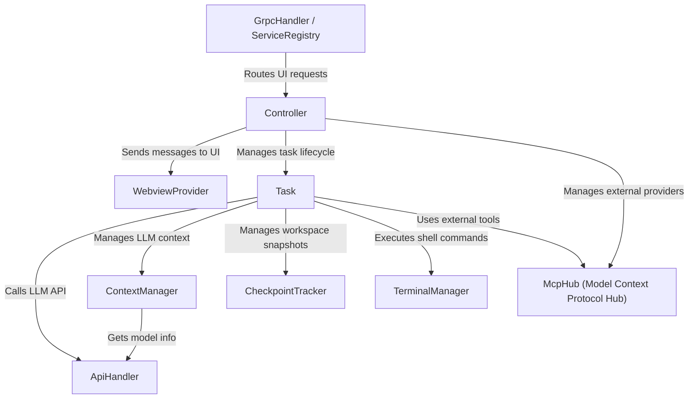

# Tutorial: Cline

Cline is a *VS Code extension* designed to integrate Large Language Models (LLMs) directly into your development workflow.
It allows you to chat with an AI assistant, asking it to perform tasks like **writing code**, **modifying files**, or **running terminal commands**.
Key features include support for various LLM providers through a unified `ApiHandler`, intelligent `ContextManager` to handle conversation limits, a `CheckpointTracker` to safely revert changes, and the ability to extend functionality with external tools via the `McpHub`.
The `Controller` orchestrates interactions between the `WebviewProvider` (UI) and the core `Task` processing logic, often using `gRPC` for structured communication.

**Source Repository:** [https://github.com/cline/cline/tree/main/src](https://github.com/cline/cline/tree/main/src)

## Chapters

1. [WebviewProvider
](01_webviewprovider_.md)
2. [Controller
](02_controller_.md)
3. [Task
](03_task_.md)
4. [ApiHandler
](04_apihandler_.md)
5. [CheckpointTracker
](05_checkpointtracker_.md)
6. [ContextManager
](06_contextmanager_.md)
7. [TerminalManager
](07_terminalmanager_.md)
8. [McpHub (Model Context Protocol Hub)
](08_mcphub__model_context_protocol_hub__.md)
9. [GrpcHandler / ServiceRegistry
](09_grpchandler___serviceregistry_.md)

---

Generated by [AI Codebase Knowledge Builder](https://github.com/The-Pocket/Tutorial-Codebase-Knowledge)